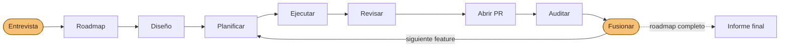

<p align="center">
  
</p>

<p align="center">
  <a href="https://www.youtube.com/watch?v=2Ai0NkTvoeM">
    
  </a>
  <br>
  <sub style="font-size: 0.75em;"><code>ship-roadmap</code> creando una PR de principio a fin en un repositorio de ejemplo — clic para ver</sub>
</p>

# Agentic Workflow Skills

> 🇬🇧 [English version](README.md)

Un conjunto reutilizable de **skills para agentes** que ejecutan un flujo de
trabajo disciplinado y dirigido por documentación para construir software con
agentes — desde una idea o issue hasta un cambio revisado, clasificado y listo
para fusionar. Las skills son **adaptativas al proyecto**: descubren y obedecen
en tiempo de ejecución la guía, la arquitectura, el roadmap y las guías de estilo
de cada repositorio, así que el mismo flujo funciona en cualquier stack.

Son Markdown plano (ficheros `SKILL.md`), así que funcionan con **cualquier
agente** que lea skills — Claude Code, Cursor, Codex, OpenCode, Cline y
[más de 70](https://skills.sh) — instaladas con la CLI
[`skills`](https://github.com/vercel-labs/skills) (ver
[Instalación](#instalación)).

> Los ejemplos en `docs/` son genéricos e ilustrativos; las skills en sí
> son agnósticas del stack y de la arquitectura.

> ## ⚠️ Cambio incompatible (v3, 2026-07-04): la rama por defecto ahora es agnóstica de modelo
>
> `npx skills add gtrabanco/agentic-workflow` (sin `#ref`) instala ahora lo que
> antes era la variante **`#inheritance`**: ninguna skill lleva frontmatter
> `model:`/`effort:`, así que cada skill simplemente **hereda el modelo y el
> effort que ya esté usando tu sesión de agente**. El objetivo: usar este
> workflow nunca debería atarte al catálogo de modelos de un único proveedor —
> tú eliges el modelo, las skills solo aplican la disciplina.
>
> - **¿Usas Claude Code y quieres los niveles Opus/Sonnet + effort ajustados
>   por skill que este proyecto traía por defecto?** Instala la rama
>   **`#claude`**: `npx skills add gtrabanco/agentic-workflow#claude`.
> - **¿Ya tenías fijado `#inheritance`?** No hay que hacer nada — `#inheritance`
>   sigue funcionando, mantenida como alias exacto de la rama por defecto.
> - **Todo el resto** (cualquier otro agente, o si prefieres elegir tú los
>   niveles): el comando de instalación normal de abajo ya te da esta rama —
>   no hace falta nada más.
>
> Ver [`docs/workflow/MIGRATION.md`](docs/workflow/MIGRATION.md) para la
> justificación completa y las notas de actualización.

## Qué incluye

```
skills/                  las 31 skills fuente (17 de cara al usuario + 14 internas; 30 instalables)
.claude/skills           symlink → ../skills, para que este repo las use en Claude Code
template/                 el scaffold de documentación exportable (el sustrato que leen las skills)
docs/workflow/           el tutorial completo (flujo de feature, de issue, referencia, replicación)
docs/features/_TEMPLATE  plantilla de SPEC de feature + ROADMAP (los artefactos que generan las skills)
docs/fix/                plantilla de SPEC de fix + índice
.github/                 plantillas de issue + PR que el flujo espera
```

Las skills son el **comportamiento**; `template/` es el **sustrato** que leen (un
`CLAUDE.md` genérico + mapa de documentación, plantillas de SPEC/feature/fix y
plantillas de GitHub). Genera la forma de trabajo de un proyecto nuevo con
`npx degit gtrabanco/agentic-workflow/template mi-proyecto` — ver
[`docs/workflow/REPLICATE.md`](docs/workflow/REPLICATE.md).

Las skills más grandes usan carga progresiva de un salto en lugar de pagar todo
su coste de instrucciones al activarse. En particular, `execute-phase` se activa
ahora con unos 3k tokens estimados en vez de 13k, y después carga solo los
contratos de la ruta que necesita. Los presupuestos versionados fuerzan esa
forma; la caché de prompts es solo una optimización opcional del proveedor,
nunca una dependencia de corrección. Ver
[Presupuesto de contexto y carga progresiva](docs/workflow/SKILLS.es.md#presupuesto-de-contexto-y-carga-progresiva).

## Las skills

**17 skills de cara al usuario** (una entrada de menú cada una) + **14 internas**
que se componen por ti: los dos pasos de planificación del router `plan-feature`,
el motor de `review-change`, el contrato `orchestration-envelope`, el **pack de revisión interno propio de 9 skills**
(`review-code`, `review-security`, `review-verify`, `review-debt`,
`review-design`, `review-a11y`, `review-brand`, `review-perf`, `review-seo`), y
el ayudante de mantenimiento interno `bump-skill` (excluido de la instalación) —
así que **nunca se requiere una skill de revisión externa**, en ningún agente y
con ningún modelo. Un único camino disciplinado:
**design → plan → execute → review → audit → merge.**

> Las formas de invocación y flags de cada skill (`--fix`, `--force`,
> `--adversarial N`, `--next`, `--fullauto`, …) están catalogadas en la
> [referencia de invocación y argumentos](docs/workflow/SKILLS.md#invocation--arguments-reference)
> (en inglés; su traducción llega con [#37](https://github.com/gtrabanco/agentic-workflow/issues/37)).

### Configuración inicial

| Skill            | Qué hace                                                                                                                                                                                                            |
| ---------------- | ------------------------------------------------------------------------------------------------------------------------------------------------------------------------------------------------------------------- |
| `init-workspace` | Trae y adapta `template/` por entrevista: gate, mapa de docs, arquitectura, inventario de capacidades, invariantes opcionales y etiquetas a prueba de inyección. Detecta Claude Code, Cursor, Copilot u OpenCode y ofrece explícitamente el guard de seguridad del repositorio — nunca instala ni sobrescribe hooks sin consentimiento. Los scaffolds existentes entran en **modo upgrade** aditivo y reciben solo los bloques/adaptadores ausentes. |
| `discover-repository-state` | Crea y congela un ledger de estado del repositorio respaldado por evidencia antes de planificar o implementar; hechos, decisiones, documentación, trabajo planificado e inferencia permanecen separados |
| `resolve-repository-state` | Único escritor de una contradicción explícita del estado; verifica la evidencia y publica el siguiente snapshot congelado |

### Diseño

| Skill            | Qué hace                                                                                                                                                                                                                                                                                                                                                                                                                                                                              |
| ---------------- | -------------------------------------------------------------------------------------------------------------------------------------------------------------------------------------------------------------------------------------------------------------------------------------------------------------------------------------------------------------------------------------------------------------------------------------------------------------------------------------- |
| `design-feature` | **Definición de producto.** Incorpora la entrevista de idea en crudo y luego recorre tres checklists fijas de **cierre de capacidades** — **cierre de entidades** (por entidad: CRUD + transiciones de estado, cada una con punto de entrada UI + superficie API + test, o un `n/a: <razón>` explícito), **cierre de integración** (la feature reconciliada contra cada subsistema del inventario de capacidades del proyecto, `docs/CAPABILITIES.md`: auth, ACL, navegación, notificaciones, … — una fila resuelta por subsistema, ninguno omitido) y una **matriz de roles** (cada rol del inventario explícitamente permitido/denegado por capacidad) — hacia criterios de aceptación exhaustivos, más un **barrido de expectativas** (≥ 10 expectativas implícitas del dominio — "un blog tiene borradores" — cada una forzada a in-scope/out-of-scope/deferred, nunca sin mencionar). Clasifica invariantes arquitectónicas opcionales con evidencia del repositorio y se detiene para una decisión explícita cuando una regla cambia. Escribe la **mitad de producto** del SPEC, sella `## Design status: designed`, y pone la fila del roadmap de la feature en `defined` (la transición `idea → defined`). Hace upsert al reejecutarse; nunca destruye decisiones registradas. |

### Planificación

| Skill          | Qué hace                                                                                                                                                                                                                                                                                                                                                                                                                                                                                                                    |
| -------------- | --------------------------------------------------------------------------------------------------------------------------------------------------------------------------------------------------------------------------------------------------------------------------------------------------------------------------------------------------------------------------------------------------------------------------------------------------------------------------------------------------------------------------- |
| `plan-feature` | **Router de planificación de ingeniería para una feature ya diseñada.** La puerta de redirección se basa primero en el **estado del roadmap** — `idea`/ausente → PARA → `design-feature`, sin flag de bypass; `defined` → continúa a Routing; **`planned`/`in-progress`/`done` → PARA, remite a `/execute-phase` (nunca re-genera el andamiaje de una feature ya planificada)**; el marcador `## Design status` del SPEC es solo el fallback de compatibilidad legacy para una fila `planned` previa a la migración. Ante una feature diseñada, un issue `#N` (issue → mitad de producto acotada) o un slug/SPEC ya acotado (directo al scaffolding de la mitad de ingeniería), enruta al paso correcto, comprueba invariantes arquitectónicas opcionales con evidencia y registra la entrada en el roadmap (releyendo la escritura `defined → planned` para confirmar que se aplicó). `--next` planifica el siguiente elemento **`defined`** del roadmap. **Dimensiona cada feature** (`XS/S/M/L`): las pequeñas van por la vía SPEC-only con ≥ 2 fases en el SPEC (la última = `Hardening & PR`) — sin ceremonia de artefactos; las M/L llevan el set completo con fase de hardening obligatoria. |
| `plan-fix`     | El equivalente del flujo de fix: como arquitecto redacta un SPEC de fix acotado a partir de uno o varios issues (`/plan-fix <n> [<n2> …]` — varios números se fusionan en UNA unidad solo si una checklist fija de causa-raíz-compartida se cumple, si no se niega e imprime la división) — siempre con un ledger `## Phases` (≥ 2 fases, la última = `Hardening & PR`) — commitea en una rama de fix y **se detiene para revisión**.                                                                                                                                                                                                                                                                                                                                                           |

> `design-feature` (definición de producto, incorpora la entrevista de idea en
> crudo) debe marcar una feature como `designed` antes de que `plan-feature` la
> planifique — si no, `plan-feature` se detiene y redirige, sin flag de bypass.
> Una vez diseñada, solo llamas a `plan-feature`; este compone los pasos
> internos `plan-feature-from-issue` y `plan-feature-scaffold` (ocultos del
> menú).

### Ejecución

| Skill           | Qué hace                                                                                                                                                                                                                                                                                                                                                                                                            |
| --------------- | ------------------------------------------------------------------------------------------------------------------------------------------------------------------------------------------------------------------------------------------------------------------------------------------------------------------------------------------------------------------------------------------------------------------- |
| `execute-phase` | Implementa una fase por invocación — de una feature (por defecto), de una feature pequeña `XS/S`, o de un fix (`--fix`); las fases de XS/S y fixes viven en el `## Phases` del SPEC (≥ 2 fases, la final siempre `Hardening & PR` — la cadena de cierre en su propio turno), y un SPEC legacy sin `## Phases` se ejecuta de una pasada. **Gate de dependencias primero**: el cierre transitivo de `Depends on:` debe estar fusionado, o se detiene con la cadena incumplida y el orden de construcción (`--force` lo salta, registrado); después una **precondición de estado propio** redirige una unidad por debajo de `planned` (`idea` → `/design-feature`, `defined` → `/plan-feature`); luego un **guardia de pre-vuelo de lint de fase** ejecuta la checklist canónica de atomicidad de 8 casillas contra la fase objetivo, deteniéndose con un bloque fijo ante cualquier FAIL (`--force` lo salta, registrado). **Puerta de invariantes arquitectónicas**: clasifica reglas opcionales del proyecto con evidencia del repositorio antes de editar; violaciones y reglas nuevas/cambiadas se detienen para una decisión explícita. **Tests primero** en trabajo de dominio/orquestación, nunca commitea en rojo, verificada por el gate, un commit por fase; **recomienda un checkpoint de `review-change` según una cadencia basada en disparadores — límite de capa, acumulación o sensibilidad (omitible) — y hace hand-off una vez al final (obligatorio)**. **Política de hallazgos oportunistas**: un hallazgo descubierto fuera de alcance se registra de forma determinista como `Autofix`, `Opportunistic Fix` o `Create Issue`; solo un fix local y de bajo riesgo dentro de los límites declarados puede entrar en el commit de la fase. **Guardia de descope**: antes de crear cualquier issue, lo clasifica como trabajo descubierto (se archiva libremente) o descope (solapa un criterio de aceptación/tarea incumplido) — un descope PARA hasta que exista una entrada `## Amendments` fechada y aprobada por el usuario; un issue nunca es el primer registro de un descope. **Una fase = una sesión** en modelos no-frontera (nunca dos fases en una misma conversación — el patrón por lotes de `/loop` ya reinvoca por fase). Una unidad terminada **siempre abre su PR, imprime la URL del PR en el chat y pasa a `done`** (construida, no mergeada); ningún turno acaba con el árbol sucio, y con el PR abierto cada commit se pushea inmediatamente. |

### Revisión y auditoría — _cambio → PR → producto_

| Skill           | Alcance         | Qué hace                                                                                                                                                                                                            |
| --------------- | --------------- | ------------------------------------------------------------------------------------------------------------------------------------------------------------------------------------------------------------------- |
| `review-change` | el **cambio**   | Ejecuta solo las revisiones que **aplican a tu plataforma** (código, seguridad, verify, diseño, a11y, marca, rendimiento, SEO) — adversariales por defecto, asumiendo que el diff está mal hasta probar lo contrario — y clasifica → una tabla de decisión + una checklist explícita de verificación manual; un árbol sucio o commits sin push en la rama del PR son hallazgos `workflow` fix-now. La revisión final obligatoria **debe correr en una conversación que no implementó el cambio** — si lo hizo, parar y hacer hand-off a una nueva. Opt-in `--adversarial N`: N revisores independientes y context-clean, cada uno con un rol asignado por índice (corrección/seguridad/cobertura-de-SPEC), corren en paralelo (subagentes / headless / fallback secuencial), hallazgos fusionados por `file:line` con umbral de inclusión ≥1 — desactivado por defecto, auto-recomendado (nunca forzado) cuando el cambio es `L`/sensible, el revisor no es el más fuerte de la flota o es más débil que el autor del diff, o solo hay una familia de modelo disponible en un cambio `≥M`. `--merge` es el punto de entrada de fusión independiente para revisores ejecutados a mano. Los hallazgos fix-now en una unidad no mergeada se persisten en el ledger de fold fix-now de esa unidad (`review-findings.md`), deduplicado por `file:line`+axis. La clasificación respeta las **comprobaciones de anulación hacia fix-now** del motor: un arreglo barato o un defecto dentro de alcance es siempre fix-now (nunca un escape a postpone/known-issue/tradeoff), y un fix-now dentro de alcance demasiado grande se enruta a `replan-in-unit` — fase(s) del SPEC confirmadas por el usuario en la misma rama, nunca una degradación |
| `fold-findings` | el **ledger de hallazgos** | Repara de verdad, uno por uno, cada hallazgo fix-now de `review-change`/`audit-pr` — **clasificación congelada** (nunca reclasifica; una objeción genuina produce `DISPUTED` → `triage-issue`) y una **lista de prohibiciones** fija que cierra las válvulas de escape de volcado-a-known-issues/downgrade de severidad/aflojar tests/supresión de lint/stub `TODO`, terminando en un veredicto `FOLDED \| DISPUTED \| BLOCKED \| REPLAN` por hallazgo + total (`REPLAN` traspasa un hallazgo dentro de alcance demasiado grande a fase(s) del SPEC confirmadas por el usuario + `execute-phase` en la misma rama). Tras un veredicto BLOCKED de `audit-pr` con el ledger ausente/incompleto, reconstruye las filas desde el propio veredicto — nunca "no hay hallazgos" mientras se listan blockers. La checklist del ciclo de fold embebida en `execute-phase` se mantiene como fallback en contexto/portabilidad |
| `audit-pr`      | el **PR**       | Gate de fusión de solo lectura: aceptación, fases, docs/tests/CI, trazabilidad, ejes de review, cierre de capacidades, integridad de descope e invariantes arquitectónicas → **MERGE-READY o bloqueantes con evidencia**, siempre con la URL completa. MERGE-READY publica un comentario de PR ligado al SHA; BLOCKED persiste bloqueantes en el ledger común de fold. Nunca edita ni fusiona: solo una etapa activa `ship-roadmap --fullauto` puede consumir su veredicto e invocar el wrapper transitorio. |
| `product-audit` | el **producto** | Chequeo periódico de espectro completo solo por invocación explícita, persistido como `docs/audits/<id>-<fecha>.md`; extrae de código e historial hallazgos por severidad y propuestas de issues/roadmap/tooling, comprueba la frescura del inventario y la exportación repetida de alcance, y nunca arregla automáticamente. |
| `audit-docs`    | las **docs**    | Audita docs ↔ roadmap ↔ código ↔ índice de fixes en busca de desviaciones                                                                                                                                           |

`review-change` y `audit-pr` también evalúan el documento opcional del proyecto
`ARCHITECTURAL_INVARIANTS.md`: cada regla aplicable necesita evidencia del
repositorio de que el cambio la preserva, o una decisión arquitectónica
explícita. Los proyectos que no declaran el documento siguen siendo compatibles.

> El motor de hallazgos de `review-change` es el `review-implementation` interno
> — la pasada de dos fases encontrar → clasificar que compone (y que reutilizan
> `audit-pr` / `product-audit`) — más el pack de revisión interno: una skill
> `review-*` por eje, cada una una checklist fija que devuelve una tabla de
> hallazgos + PASS|FAIL. Ninguna es entrada de menú; llegas a ellas a través de
> `review-change`.

### Decisión

| Skill          | Qué hace                                                                                                   |
| -------------- | ---------------------------------------------------------------------------------------------------------- |
| `triage-issue` | Clasifica un issue (fix-now / fix-in-unit / promote / postpone / wontfix) **verificando su disparador contra el código**; un chequeo de pertenencia de alcance (antes de clasificar) enruta un issue que ya pertenece a una unidad abierta a la propia rama de esa unidad (`fix-in-unit`), nunca a una unidad nueva independiente; en fix-now + severidad alta, aplica la etiqueta `urgent`/`fix-next` a prueba de inyección que posee; en postpone/promote/wontfix, aplica la etiqueta de disposición correspondiente que posee (`postponed`/`promoted`/`wontfix`); también tría hallazgos persistidos de `product-audit` (`triage-issue <audit-id> F<k>`), abriendo el issue solo si el veredicto lo justifica |

### Documentación

| Skill           | Qué hace                                                                                                                                                                                                                                                                                                                                                                                                                                                                                                       |
| --------------- | ---------------------------------------------------------------------------------------------------------------------------------------------------------------------------------------------------------------------------------------------------------------------------------------------------------------------------------------------------------------------------------------------------------------------------------------------------------------------------------------------------------------- |
| `generate-docs` | Convierte el diff de una unidad en **documentación de desarrollador en el sitio de docs del propio proyecto** — guías how-to incrementales mediante un adaptador descubierto (Starlight MDX de primera clase, markdown plano como fallback), un **mapa de conocimiento/llamadas** renderizado desde un comando determinista declarado por el proyecto (el modelo nunca infiere aristas) y export opt-in `--review` de informes de revisión. El frontmatter de procedencia permite a `audit-docs` cazar páginas huérfanas/obsoletas; nunca crea el sitio, nunca edita código. |

### Sesión

| Skill         | Qué hace                                                                                                                                                                                                                                                                                                                                                                                                     |
| ------------- | ------------------------------------------------------------------------------------------------------------------------------------------------------------------------------------------------------------------------------------------------------------------------------------------------------------------------------------------------------------------------------------------------------------ |
| `log-session` | Añade una entrada estructurada a `docs/LOGS.md` — qué hizo la sesión, archivos tocados, decisiones + _por qué_, y el siguiente paso — para que tú (o cualquiera) retome en frío. Ejecútala antes de `/clear` o de cerrar. El `template/` además trae **hooks gratuitos y opt-in** que añaden una entrada mecánica automáticamente en cada `/clear`/salida y pueden reinyectar la última entrada al arrancar. |
| `workflow-status` | **Sensor de solo lectura para orquestación programática.** Calcula el estado completo del proyecto — cada feature/fix con su cierre de dependencias transitivo (cumplido/incumplido), la máquina de cinco estados del roadmap (`idea`/`defined`/`planned`/`in-progress`/`done`), qué es arrancable ahora mismo (estado ≥ `defined`, dependencias cumplidas) y en qué orden de construcción, las filas `idea` reportadas aparte como candidatas a diseño, PRs abiertas + estado de auditoría, fixes pendientes y hallazgos a la espera de triaje, el backlog de issues abiertos sin triar (`detail.untriaged_issues`, con la etiqueta de disposición como señal autoritativa y el comentario `VERDICT:` como fallback heredado), los hallazgos fix-now sin foldear de cada unidad, leídos de su ledger `review-findings.md`, como items estructurados `findings.fix_now[]` con un `suggested_tier` derivado, más el campo `detail.urgent` a prueba de inyección (issues `urgent`/`fix-next` solo por etiquetas + hechos de interrumpibilidad de la unidad en curso) y, por unidad, `review` (sha del último checkpoint revisado, diff sin revisar, evidencia de revisión terminal/adversarial), `closure.state`, e `issues_born` (procedencia de enmiendas de descope) — y lo emite como un envelope máquina JSON fijo, con un `next.suggested[]` de nivel superior de sugerencias atribuidas a un trigger, con fuente única desde la condición propia de cada skill dueña, autocomprobado contra el esquema empaquetado y una tabla fija comando→nivel antes de imprimirse. Con `--last-envelope`, una **guarda de no-progreso** señala un hint `/plan-feature`/`/design-feature` estancado (la unidad sigue en su estado previo al avance) como una nota en `workflow_observations` en vez de repetirlo silenciosamente. La pieza que un driver externo llama entre pasos (ver [Orquestación programática](#orquestación-programática)). Nunca edita nada. |

### Mantenimiento del repo

| Skill        | Qué hace                                                                                                                                                                                                                                                                                                                                                                                                     |
| ------------ | ------------------------------------------------------------------------------------------------------------------------------------------------------------------------------------------------------------------------------------------------------------------------------------------------------------------------------------------------------------------------------------------------------------ |
| `bump-skill` | Tras editar una skill en este repo: sube la `version:` en el frontmatter del SKILL.md, añade filas en CHANGELOG.md + CHANGELOG.es.md y actualiza las tablas de skills y modelos en README.md + README.es.md. Además **lintea las reglas de autoría del repo** (toda skill cierra con un bloque `→ Next:`; las fases son `P1, P2, …`, nunca `S1`/"Steps") y las **reglas de registro en superficies máquina** (toda skill `user-invocable: true` tiene su entrada correspondiente en `.claude-plugin/plugin.json`; ese array y las claves de `model-routing.yml` se mantienen en orden alfabético; toda skill que sea a la vez `user-invocable: false` y esté ausente de `plugin.json` —interna del repo, sin sentido para un consumidor— lleva `metadata.internal: true`, el mecanismo propio de la CLI `skills` para no aparecer en el descubrimiento de `npx skills add`). Ejecutar antes de cada commit que toque una skill. |

### Autopilot — el flujo completo, de punta a punta

| Skill          | Qué hace                                                                                                                                                                                                                                                                                                                                                                                                                                                                                                                                                                                                                                                                   |
| -------------- | -------------------------------------------------------------------------------------------------------------------------------------------------------------------------------------------------------------------------------------------------------------------------------------------------------------------------------------------------------------------------------------------------------------------------------------------------------------------------------------------------------------------------------------------------------------------------------------------------------------------------------------------------------------------------- |
| `ship-roadmap` | **Construye la app entera desde el roadmap.** Una entrevista fundacional bloqueada se convierte en diseño por lotes; un bucle de driver diseña, planifica, ejecuta, revisa, abre y audita una unidad por iteración, después barre issues y escribe el informe final. Por defecto abre PRs y tú fusionas. `--fullauto` es la única autoridad de merge automatizado: tras una auditoría fresca ligada al SHA llama al wrapper transitorio fail-closed, mantiene bloqueados los comandos directos, limpia el estado del intento en cada salida y registra cada automerge con un comentario idempotente en la PR. |

Cómo el autopilot ejecuta el flujo — una entrevista al entrar, PRs revisadas al
salir, y tú solo apareces para fusionar (ámbar):



Es el mismo camino `planificar → ejecutar → revisar → auditar → fusionar` que
harías a mano — el autopilot solo te mueve a sus extremos. Con `--fullauto`,
`ship-roadmap` fusiona mediante el wrapper transitorio del repositorio, bajo
suelos de seguridad innegociables, y registra cada merge en su PR. Los hooks
portables son defensa en profundidad: bloquean merges directos y volcados obvios
de secrets en el límite del agente, mientras los rulesets del forge siguen siendo
la frontera real de seguridad.

Los ejes de revisión son **autocontenidos**: el pack de revisión interno incluido
cubre código, seguridad, verify, deuda, diseño, a11y, marca, rendimiento y SEO en
cualquier agente. Los extras específicos de plataforma (una skill de framework, un
linter del stack) son opcionales — `review-change` y `product-audit` los ejecutan
**además**, nunca como dependencia. Ver `docs/workflow/RECOMMENDED_SKILLS.md`.

> **¿Actualizas desde una instalación anterior?** Mira
> [`docs/workflow/MIGRATION.md`](docs/workflow/MIGRATION.md) — se renombraron tres
> skills, así que vuelve a añadirlas para actualizar + borra las tres carpetas
> antiguas.
>
> **Versionado.** Cada skill se versiona de forma independiente (`version:` en su
> frontmatter); los cambios se registran en [`CHANGELOG.md`](CHANGELOG.md).
> Actualiza con `npx skills update`.

## Modelo y esfuerzo recomendados

**Esta sección documenta la rama `#claude`** —
`npx skills add gtrabanco/agentic-workflow#claude`. La **rama por defecto**
(`main`, con alias `#inheritance`) no lleva nada de esto: cada skill
simplemente hereda el modelo y el effort que ya use tu sesión de agente, así
que no hay nada que configurar ni que pueda caducar.

En la rama `#claude`, cada skill **fija su modelo y su esfuerzo** en el
frontmatter (tabla abajo), tomados de
[`docs/workflow/model-routing.yml`](docs/workflow/model-routing.yml). El
modelo usa un alias de tier flotante (`opus`/`sonnet`/`haiku`) que se auto-actualiza
a la última versión — así no caduca. Ambos aplican solo durante el turno de esa
skill; tu modelo/esfuerzo de sesión vuelven después. **Tú mandas:** para cambiarlos,
edita `model-routing.yml` (la fuente que lee la CI para reconstruir la rama
`claude` — nunca edites el frontmatter de la rama `claude` directamente, se
sobrescribe con force-push en cada cambio a `main`).

**En agentes distintos de Claude Code, o en la rama por defecto**, estos tiers
no aplican — y está cubierto: toda skill de cara al usuario incluye una sección
**Portability** con fallbacks explícitos (sin menú slash → seguir el `SKILL.md`
objetivo en una conversación nueva; sin tiers de modelo → el modelo más fuerte
para planificar/revisar/auditar, uno más barato para ejecutar; sin
`/loop`/subagentes → re-invocación manual guiada por el bloque de cierre
`→ Next:` de cada skill). El workflow es el contrato; los tiers por skill son
una conveniencia de la rama `#claude`.

| Skill            | Tier de modelo | Esfuerzo | Por qué                                                                                                                                                                                                                     |
| ---------------- | -------------- | -------- | --------------------------------------------------------------------------------------------------------------------------------------------------------------------------------------------------------------------------- |
| `init-workspace` | Opus           | alto     | bootstrap del proyecto guiado por entrevista + adaptación                                                                                                                                                                   |
| `discover-repository-state` | Sonnet         | medio    | recopilación de evidencia y snapshot congelado del estado del repositorio                                                                                                                                                   |
| `resolve-repository-state` | Opus           | alto     | resolución de contradicciones y juicio sobre el estado del repositorio                                                                                                                                                     |
| `design-feature` | Opus           | alto     | juicio de definición de producto: entrevista de idea en crudo + cierre de capacidades, compuesta por quien la llame solo a tier ≥                                                                                          |
| `plan-feature`   | Opus           | alto     | router + planificación de ingeniería: sus pasos internos de scoping corren **en su turno**, así que el router debe llevar el effort (las skills compuestas heredan el effort del turno)                                     |
| `plan-fix`       | Opus           | alto     | scoping de arquitecto + análisis de riesgo                                                                                                                                                                                  |
| `execute-phase`  | Sonnet         | medio    | implementación mecánica según el SPEC — una fase por invocación (Opus si la lógica es sutil)                                                                                                                               |
| `review-change`  | Opus           | alto     | orquestación de revisión adaptativa a la plataforma + síntesis                                                                                                                                                              |
| `fold-findings`  | Opus           | alto     | nunca por debajo del nivel de la revisión que produjo el hallazgo; un hallazgo sutil de lógica/seguridad merece su propio pase con lo más fuerte disponible                                                                 |
| `audit-pr`       | Opus           | alto     | juicio de aptitud de fusión de todo el PR                                                                                                                                                                                   |
| `product-audit`  | Opus           | máx      | barrido multi-eje de todo el producto + propuestas (effort máx para el barrido más amplio)                                                                                                                                  |
| `audit-docs`     | Sonnet         | medio    | comprobaciones cruzadas mayormente mecánicas (Opus para auditorías profundas)                                                                                                                                               |
| `triage-issue`   | Opus           | alto     | verificar disparadores contra el código; decisión con criterio                                                                                                                                                              |
| `log-session`    | Sonnet         | medio    | resumen estructurado, no criterio — deliberadamente el tier barato, nunca Opus (los hooks de `.claude/` hacen la captura mecánica gratis)                                                                                   |
| `workflow-status`| Sonnet         | medio    | lectura mecánica de estado + cálculo de cierres de dependencias — un sensor, nunca juicio                                                                                                  |
| `generate-docs`  | Sonnet         | medio    | resumen estructurado de un diff en páginas de guía; el grafo lo genera tooling, nunca lo infiere el modelo (Opus nunca es necesario)                                                       |
| `ship-roadmap`   | Opus           | alto     | el conductor del autopilot: compone en su turno las skills de planificación/revisión/auditoría (mismo tier) y delega la implementación a subagentes Sonnet — el juicio se mantiene fuerte, los tokens masivos salen baratos |

> Las skills internas no se seleccionan directamente. Como se componen **dentro
> del turno del caller**, heredan su modelo/effort (el `model`/`effort` de una skill
> se fija al inicio del turno) — los valores de su frontmatter
> (`review-implementation`, `plan-feature-from-issue`, `review-code`,
> `review-security` alto; `plan-feature-scaffold` y el resto del pack de
> revisión medio) son defaults para una ejecución directa, y por eso los
> orquestadores `plan-feature` y `review-change` llevan `high`.
>
> Regla general: **planificar, decidir, revisar y auditar → Opus** (alto, o máx para
> el barrido de todo el producto); **ejecución mecánica → Sonnet, medio** (sube a Opus
> si la lógica es sutil).

### Equivalencia de modelos (modelos no-Claude / de libre inferencia)

Los tiers de Claude de arriba (la rama `#claude`) marcan un listón de
referencia, pero nada en el workflow depende de ellos — las skills son
agnósticas del modelo por diseño (ese es justo el sentido de la rama por
defecto). Si estás en la rama por defecto, esta tabla es solo una guía mental
de qué "tipo" de modelo apuntar tú mismo a cada skill; si instalaste
`#claude` de todos modos y quieres cambiar sus tiers fijados por los de otro
proveedor, edita `docs/workflow/model-routing.yml`:

| Default Claude | Clase de capacidad | Úsalo para |
|---|---|---|
| Opus + `high`/`max` | **Razonamiento frontier** — el modelo más fuerte que tengas, con modo razonamiento/thinking activado | planificar, revisar, auditar, triage, el gate de fusión |
| Sonnet + `medium` | **Workhorse medio** — un buen modelo de código con ajustes por defecto | ejecución mecánica según SPEC, checks de docs, logs de sesión |
| Haiku | **Pequeño y barato** — cualquier modelo ligero y rápido | recolección opcional de evidencia tipo grep |

**Recomendaciones concretas** (open-weight, a **julio de 2026** — este panorama
se mueve rápido; contrástalo con un leaderboard actual antes de fijar nada):

- **Razonamiento frontier** (⇔ Opus + `high`/`max`): **DeepSeek V4** (lidera
  LiveCodeBench/Codeforces entre los abiertos), **Kimi K2.6** (el más fuerte en
  coding agéntico/a nivel de repo y tool use), **GLM-5.x / GLM-4.7 Thinking**,
  **Qwen3 235B-A22B** — en modo razonamiento/thinking. Equivalentes cerrados
  no-Claude: el tier de razonamiento superior de GPT / Gemini.
- **Workhorse medio** (⇔ Sonnet + `medium`): **DeepSeek V3.2** (la mejor
  relación calidad/precio vía API), **Qwen3-Coder / Qwen3 32B**, **GLM-5.1**, o
  cualquiera de los frontier con el modo razonamiento apagado.
- **Pequeño y barato** (⇔ Haiku): **Qwen3 4–14B**, **Mistral Small 3.1**,
  **Gemma 3 27B**, **Phi-4-mini** — corren en local, suficientes para trabajo
  tipo grep.

### Ejecutar todo el flujo con una flota de modelos pequeños/baratos

Los skills están endurecidos para modelos ejecutores pequeños (ventanas de
contexto modestas, sin caché de prompt): checklists fijas en lugar de juicio,
las puertas de presencia Phase-lint y Spec-lint, un esquema fijo de handoff en
`progress.md` con conversación nueva por fase, presupuestos de contexto por
fase/pasada, y revisiones aisladas por eje que devuelven solo tablas de
hallazgos. En una flota sin ningún modelo de clase frontier:

- **Ejecución** (`execute-phase`, `log-session`, mantenimiento de docs) está
  diseñada para el tier más barato — una fase por conversación, handoff vía
  `progress.md`, máximo 10 lecturas de fichero completo por fase.
- **Planificación, revisión y auditoría** (`design-feature`, `plan-feature`,
  `plan-fix`, `review-change`, `audit-pr`, `product-audit`) siguen usando el
  **modelo más fuerte que tengas**, aunque no sea frontier — y nunca uno más
  débil que el que escribió el cambio.
- **Revisiones**: mantén el aislamiento por eje por defecto (cada pasada un
  contexto nuevo, retorno solo-tabla) y prefiere `--adversarial 2` en cambios
  `L` o sensibles — N revisores baratos y descorrelacionados recuperan parte
  de lo que un único revisor pequeño no ve.
- **Divide más.** La regla de división obligatoria (≤ ~5 fases, una capa por
  fase) es la palanca principal: fases más pequeñas son lo que hace fiable la
  ejecución barata. Ante la duda, corta más pequeño.

####  Ejecutar sobre [NaN.builders](https://cloud.nan.builders/r/7GK06FX8)

[NaN Cloud](https://cloud.nan.builders/r/7GK06FX8) sirve la frontera open-weight
([catálogo completo](https://nan.builders/docs/models): GLM-5.2 ~753B MoE ·
Mimo V2.5 310B · DeepSeek V4 Flash 284B · Qwen3.6 35B · Gemma4 26B) tras una
API compatible con OpenAI (`https://api.nan.builders/v1`). El control de
razonamiento es **por modelo, no un dial uniforme** — la matriz de abajo
muestra cómo mapea cada modelo con los tiers de `effort:` de este workflow.
Regístrate con
[este enlace de referido](https://cloud.nan.builders/r/7GK06FX8).

**Dos perfiles, no un solo principal.** GLM-5.2 ya no está disponible en el
plan básico — es el principal del **plan de €200** (prácticamente ilimitado
ahí; los límites solo aprietan con uso muy intensivo). En el **plan básico**
simplemente no está disponible, así que los picks de abajo se dividen en una
columna para el plan de €200 y una escalera para el plan básico.

> **Verifica primero tu catálogo.** El listado de `/v1/models` de la
> referencia pública del API solo nombra `deepseek-v4-flash`, `mimo-v2.5`,
> `qwen3.6` y `gemma4` para chat — GLM-5.2 no aparece en él. Ejecuta
> `GET /v1/models` con tu propia key y enruta solo a los modelos que devuelva
> de verdad; trata la columna del plan de €200 de abajo como condicionada a
> esa comprobación.

**Regla de enrutamiento consciente de la cuota.** Según el catálogo, solo
**Mimo V2.5** y **DeepSeek V4 Flash** llevan un límite explícito (500M
tok/miembro/mes); **Qwen3.6** y **Gemma4** no muestran límite listado (256K
de contexto — "sin límite listado" se trata como *no confirmado*, nunca se
afirma como ilimitado). Reserva los dos presupuestos de 500M con límite para
trabajo de 1M de contexto y veredictos que gatean merges; empuja el volumen
re-comprobable y mecánico hacia los modelos sin límite en su lugar.

**Control de razonamiento por modelo** (según la referencia del API) — mapea
los valores de `effort:` de este workflow con esta matriz en vez de asumir un
dial compartido:

| Modelo | Control | Por defecto | Mapeo de `effort:` |
|---|---|---|---|
| **DeepSeek V4 Flash** | `reasoning_effort: low\|medium\|high` — campo top-level del body, no `extra_body` | `medium` | `low`/`medium`/`high` → literal; `xhigh`/`max` → `high` |
| **Qwen3.6** | booleano `chat_template_kwargs.enable_thinking` | ON | `low` → thinking off; `medium` o superior → on |
| **Gemma4** | booleano `chat_template_kwargs.enable_thinking` | OFF | `high` o superior → thinking on; si no, off |
| **Mimo V2.5** | ninguno — reasoning siempre activo, no controlable por API | ON | sin mapeo: cada petición paga tokens de razonamiento; deja margen en `max_tokens` (docs: ≥300 de mínimo absoluto) |

**El tool calling solo está validado en Qwen3.6.** La referencia del API marca
el function calling estilo OpenAI como validado específicamente en `qwen3.6`,
dice de probar el resto antes de depender de tools en producción, y documenta
el tool calling de Gemma4 en un formato XML — no el esquema `tools` de OpenAI
que envían los harnesses de agentes. Así que el camino ejecutor
(`execute-phase`, cualquier cosa que lea/edite ficheros mediante tools) usa
Qwen3.6 por defecto; ejecuta el smoke test de tool calling de
[`docs/workflow/GOLDEN_FIXTURE.es.md`](docs/workflow/GOLDEN_FIXTURE.es.md)
antes de promover cualquier otro modelo de NaN a ese camino.

**Escaleras de preferencia por tarea** (2–3 niveles en el plan básico; la
columna del plan de €200 asume que GLM-5.2 está confirmado en tu propio
catálogo vía `GET /v1/models` según la advertencia de arriba — si no está
confirmado, trata esa columna como histórica y usa la escalera del plan
básico):

| Tarea | Skills | Plan de €200 (si GLM-5.2 está confirmado) | Escalera del plan básico | Nunca aquí |
|---|---|---|---|---|
| **Puertas de merge** | `audit-pr`, `product-audit` | GLM-5.2, Thinking on, High (Max para `product-audit`) | 1. **Mimo V2.5** (reasoning siempre activo) → 2. **DeepSeek V4 Flash** (`reasoning_effort: high`, suelo) → si no, **pospón al humano** | Qwen3.6, Gemma4 |
| **Definición de producto** | `design-feature` | GLM-5.2, Thinking on, High | 1. **Mimo V2.5** (reasoning siempre activo; una familia distinta del ejecutor Qwen añade independencia) → 2. **Qwen3.6** (thinking ON — solo para features XS/S o derivadas, ahorra cuota) → 3. **DeepSeek V4 Flash** (`reasoning_effort: high`) | Gemma4; Qwen3.6 thinking OFF |
| **Planificación / enrutamiento / triage** | `plan-feature`, `plan-fix`, `init-workspace`, `triage-issue`, `review-change`, conductor de `ship-roadmap` | GLM-5.2, Thinking on, High | 1. **Qwen3.6** (ahorra cuota) → 2. **Mimo V2.5** → 3. **DeepSeek V4 Flash** | — |
| **Ejecución / mecánico** | `execute-phase`, `audit-docs`, `bump-skill`, `workflow-status` | Qwen3.6, Thinking off, Medium | 1. **Qwen3.6** → 2. **DeepSeek V4 Flash** (`reasoning_effort: low`) → 3. **Gemma4** solo tras pasar el smoke test de tool calling | Mimo V2.5 (el reasoning no se puede apagar — quema su cuota limitada) |
| **Barato** | `log-session`, recolección de evidencia | DeepSeek V4 Flash, `reasoning_effort: low` | 1. **DeepSeek V4 Flash** (`reasoning_effort: low`) → 2. **Qwen3.6** (thinking off) → 3. **Gemma4** (solo pasos no agénticos, o tras el smoke test de tools) | Mimo V2.5 |
| **Incorporar hallazgos de `review-change`/`audit-pr`** | `fold-findings` (principal); ciclo de incorporación embebido en `execute-phase` (fallback en contexto/portabilidad) | según el hallazgo (ver abajo) | hallazgo **rutinario/mecánico** (estilo, stub de test faltante, doc obsoleto) → igual que Ejecución/mecánico; hallazgo **sutil** (lógica, seguridad, arquitectura) → sube al tier que lo encontró (escalera de Puertas de merge o de Planificación/enrutamiento, la que haya corrido la revisión) | — |
| **Revisión adversarial (`review-change --adversarial N` / `--merge`)** | `review-change` | GLM-5.2 × N, Thinking on, High | los revisores nunca son más débiles que el modelo que escribió el diff; ejemplo trabajado: cambio escrito por Qwen3.6 → `--adversarial 2` con **Mimo V2.5** + **DeepSeek V4 Flash** (`reasoning_effort: high`) — dos familias distintas del ejecutor Qwen, descorrelación gratis que esta flota ya tiene; la conversación que orquesta/fusiona corre según la escalera de Planificación/enrutamiento (Qwen3.6 con thinking ON es válido ahí) | un revisor más débil que el modelo que escribió el código |

La fila de incorporación enruta a través de la skill independiente
`fold-findings`, cayendo al ciclo de incorporación embebido en
`execute-phase` solo cuando no hay una invocación separada disponible;
reemplaza a la antigua línea de "Alternativas" de un solo modelo (que solo
nombraba a GLM-5.2 para subidas de lógica sutil). Regla general: el modelo que arregla nunca es más débil
que el que escribió el código original, ni más débil de lo que exige la
sutileza del hallazgo — de lo contrario el propio arreglo necesita
volver a atraparse en la re-revisión, desperdiciando un ciclo.

**Por qué la fila adversarial se paga sola precisamente en esta flota:** la
checklist de recomendación del modo se dispara cada vez que el modelo
revisor no es el más fuerte de la flota o es más débil que el autor — en la
escalera del plan básico ese es el caso común (Qwen3.6 ejecuta la mayoría de
las unidades). Como la flota ya tiene cuatro familias de modelo distintas,
lanzar `N=2` revisores de familias distintas a la del autor es
descorrelación casi gratis, no una compra extra — la cuota ya estaba
reservada para trabajo de la clase Puertas de merge.

**Por qué `design-feature` está en la clase de puertas de merge, no en el
tier barato:** su salida — la mitad de producto del SPEC más el cierre de
capacidades — son los **supuestos fundacionales** sobre los que se construye
el resto del flujo, así que un error ahí se propaga por plan → execute →
review, el mismo radio de impacto que un veredicto de puerta de merge. El
reasoning siempre activo de Mimo V2.5 es el gasto correcto aquí (pocas
invocaciones, alto apalancamiento) — a diferencia del volumen mecánico,
donde ese mismo reasoning siempre activo quema cuota sin beneficio. Qwen3.6
con thinking activado es aceptable solo como segundo peldaño, y solo para
features XS/S o derivadas: la entrevista de idea en bruto mantiene a un
humano en el bucle, y la puerta de cierre de capacidades de `plan-feature`
vuelve a verificar la salida después (la misma advertencia de razonamiento
re-comprobado de abajo). Como con cada elección de modelo aquí, comprueba la
disponibilidad con `GET /v1/models` antes de fijarla.

**Advertencia de razonamiento de `Qwen3.6`, explícita:** aceptable solo para
razonamiento **re-comprobado** (salida de planificación/enrutamiento/triage
que revisión o auditoría verifica después) — nunca un veredicto que gatee
un merge (3B de parámetros activos → una auditoría plausible-pero-superficial
es peor que ninguna). En el plan básico, una vez gastada la cuota de Mimo
V2.5 + DeepSeek V4 Flash, no queda ningún razonador fuerte → pospón al
humano, espera al reinicio de la cuota, o sube al plan de €200.

**Pros y contras por modelo:**

| Modelo | Tamaño | Contexto | Cuota en plan básico | Bueno para | Evitar para |
|---|---|---|---|---|---|
| **GLM-5.2** | ~753B MoE | — | No disponible en el plan básico (solo plan de €200, prácticamente ilimitado ahí); no figura en el catálogo público del API — confírmalo con `GET /v1/models` | Cualquier hueco de juicio, cuando está disponible | — |
| **Mimo V2.5** | 310B, reasoning siempre activo | 1M ctx | 500M tok/miembro/mes | Puertas de merge + trabajo de contexto largo; familia distinta a Qwen3.6, así que añade independencia de revisor | Volumen mecánico/de bajo esfuerzo — el reasoning no se puede apagar, así que cada tarea barata quema la cuota limitada; tools sin validar |
| **DeepSeek V4 Flash** | 284B total · 21B activos | 1M ctx | 500M tok/miembro/mes | Volumen barato/mecánico con `reasoning_effort: low`; el único modelo de NaN con dial graduado de esfuerzo; suelo de último recurso para planificación/triage cuando 1–2 de arriba están gastados | Cualquier veredicto que gatee un merge |
| **Qwen3.6** | 35B | 256K ctx | sin límite listado | El único modelo de NaN con tool calling OpenAI validado → ejecutor agéntico por defecto; speculative decoding MTP ≈2× throughput; planificación/enrutamiento/triage (re-comprobado después) | Veredictos que gatean merges; revisar código que él mismo escribió |
| **Gemma4** | 26B | 256K ctx | sin límite listado | Tier pequeño no agéntico (texto/visión de un solo turno) | Cualquier llamada de juicio; bucles agénticos de tools hasta que pase el smoke test (tool calling en formato XML) |

**Límites operativos por API key** (de la referencia del API): 60
peticiones/min, **máximo 5 peticiones concurrentes**, 1.5M tokens/min por
modelo de chat. Limita cualquier fan-out de subagentes/revisiones (el
paralelismo de `ship-roadmap`, el pack de `review-change`) a ≤5 concurrentes
— 3–4 en la práctica, dejando margen para el conductor — y recuerda que un
bucle agéntico gasta una petición por cada ida y vuelta de tool, así que
varios agentes en paralelo alcanzan los 60 rpm enseguida.

Whisper, Kokoro, Rerank, Qwen3 Embedding y Flux 2 Klein son modelos de
audio/retrieval/imagen — el workflow no los usa. La fuerza de los modelos de
arriba se enmarca por parámetros activos + rol, no por números de
benchmark — verifica contra un leaderboard actual antes de fijar; este
panorama cambia rápido.

**¿Ya estás en la rama por defecto (o en `#inheritance`)?** No hay nada que
quitar — es justo el punto. Cada skill ya **hereda el modelo y esfuerzo de tu
sesión**; el comando de instalación normal te da esto:

```sh
npx skills add gtrabanco/agentic-workflow
```

**¿Prefieres los tiers de Claude fijados por skill?** Instala `#claude` (ver
la nota de cambio incompatible cerca del principio de este README):

```sh
npx skills add gtrabanco/agentic-workflow#claude
```

`effort:` se mapea al presupuesto de razonamiento/thinking de tu modelo (`high` →
razonamiento máximo; `medium` → por defecto; sin ese control → respeta solo la
división fuerte/barato de arriba). Dos invariantes sobreviven a cualquier mapeo:
**nunca revises un cambio con un modelo más débil que el que lo escribió — y
prefiere una familia de modelo distinta a la del autor** (instancias de la
misma familia comparten puntos ciegos de entrenamiento; una familia cruzada
descorrelaciona errores), y **los veredictos de auditoría (el gate de fusión)
van al modelo más fuerte que tengas**. Espera que los modelos más débiles sigan
el workflow correctamente — las skills están escritas como checklists y
formatos de salida fijos — pero con un juicio menos profundo: la disciplina se
mantiene, el techo se mueve.

## Orquestación programática

Las skills se leen limpias en el chat interactivo — sin JSON al final. Un
driver que quiera orquestarlas (un bucle de shell, CI, tu propio programa)
inyecta el **snippet canónico de system-prompt** para que cada invocación
termine con un **envelope máquina** — un bloque JSON fijo y cercado (state,
unit, phase, PR, findings, blockers, orden de construcción de dependencias,
siguiente comando recomendado + pista de tier de modelo) — y ejecuta un
**bucle de reparación** cuando un turno lo omite (reintenta con un prompt de
una línea; un reintento, luego un fallo a nivel de driver). En providers con
structured outputs estrictos (`response_format: {type: "json_schema",
strict}` — en NaN: `qwen3.6` y `gemma4`), es preferible forzar el envelope
pasando el `envelope.schema.json` del paquete npm como response format en el
turno final del envelope; el bucle de reparación queda como fallback para los
modelos que no lo soporten. El driver lo
parsea e invoca la siguiente skill con el modelo que tú elijas en cada paso.
Es la sustitución neutral de proveedor del `/loop` y los subagentes de Claude
Code: el mismo bucle que `ship-roadmap` ejecuta dentro del agente, alojado
fuera de cualquier agente. `workflow-status` es la única skill que sigue
emitiendo el envelope en línea — es un sensor de solo lectura que reporta el
árbol de dependencias completo y qué es arrancable, así que emitirlo es toda
su función. Protocolo, snippet, bucle de reparación, máquina de estados y
esqueleto de driver:
**[`docs/workflow/ORCHESTRATION.md`](docs/workflow/ORCHESTRATION.md)**. Para
drivers JS/TS, **[`@gtrabanco/agentic-workflow-schema`](packages/agentic-workflow-schema/)**
(npm) trae los tipos, el JSON Schema y `parseEnvelope()` implementando el
contrato de parseo — publicado automáticamente por CI en cada cambio del esquema.

## Cómo usarlas

Tutorial completo en **[`docs/workflow/`](docs/workflow/README.md)**. En resumen:

### Construir una feature

```
/plan-feature "<tu idea>"     # o  /plan-feature <N> (issue)  ·  /plan-feature --next (siguiente elemento del roadmap)
        → el router detecta idea / issue / slug acotado → entrevista · análisis del issue · scaffold
        → rellena el SPEC + PLAN + TASKS + … y registra la entrada en el roadmap
/execute-phase <NN> <phase>     # una fase cada vez, verificada por el gate, un commit cada una
        → checkpoint de revisión recomendado por disparador (límite de capa/acumulación/sensibilidad; obligatorio al final)
        → una unidad terminada siempre abre su PR + pasa a `done` (construida, no mergeada)
/review-change                  # obligatorio: revisiones aplicables, clasificadas; no-fix-now → triage-issue
/audit-pr                       # gate de fusión: listo o bloqueantes (nunca fusionar con docs pendientes)
        → el humano fusiona
```

Ver **[`docs/workflow/FEATURE_WORKFLOW.md`](docs/workflow/FEATURE_WORKFLOW.md)**.

### Gestionar un issue

```
/triage-issue <N>
   → lee el disparador "cuándo arreglar" del issue, lo verifica contra el código actual
   → fix-now     → plan-fix → execute-phase --fix
     fix-in-unit → se resuelve en la propia rama de la unidad abierta (execute-phase / fold-findings / replan)
     promote     → plan-feature   (el router toma el issue → SPEC acotado)
     postpone    → comentario con fecha, dejar abierto (sin trabajo inline)
     wontfix     → proponer cierre
```

Ver **[`docs/workflow/ISSUE_WORKFLOW.md`](docs/workflow/ISSUE_WORKFLOW.md)**.

### Revisar, auditar y clasificar

```
/review-change                  # ejecuta las revisiones correctas por plataforma + clasifica → una tabla + comprobaciones manuales
/audit-pr                       # ¿está ESTE PR listo para fusionar?  listo para fusionar o bloqueantes
/product-audit                  # ¿en qué punto está todo el producto?  issues + propuestas de roadmap
/audit-docs                     # ¿se han desviado las docs del código / roadmap?
```

Ver **[`docs/workflow/REVIEW_AND_CLASSIFY.md`](docs/workflow/REVIEW_AND_CLASSIFY.md)**.

### Construir la app entera (autopilot)

```
/ship-roadmap                   # UNA entrevista (producto, features, stack, arquitectura, autonomía, presupuesto)
        → funda el proyecto si hace falta, escribe el roadmap completo, fija la política del run
/loop /ship-roadmap --continue  # el bucle entrega el roadmap feature a feature (añade --fullauto para auto-fusionar)
        → plan → execute → review → PR → audit → (tu merge) → siguiente feature → … → informe final
```

Solo reapareces en los merges (por defecto) y en el informe final.

### Retomar entre sesiones

```
/log-session                    # antes de /clear o de cerrar: añade a docs/LOGS.md lo que hiciste + el siguiente paso
```

El `template/` trae hooks de Claude Code gratuitos y opt-in (`template/.claude/`)
que añaden una entrada mecánica automáticamente en cada `/clear` y salida, y
pueden reinyectar la última entrada al arrancar para retomar en frío — sin
modelo, sin coste de tokens en la captura.

## Principios fundamentales

1. **Las docs dirigen el trabajo** — cada skill lee primero la guía del proyecto,
   el mapa de docs, la arquitectura, el roadmap y las guías de estilo, y los respeta.
2. **Planificar antes de programar** — las features obtienen un SPEC + artefactos
   antes de escribir una sola línea.
3. **Una fase cada vez** — cada una verificada y commiteada por separado.
4. **Un PR por unidad, contra la rama por defecto** — nunca sobre `main`, nunca apilados.
5. **Evidencia sobre reflejo** — el triage verifica disparadores; el trabajo
   diferido se rastrea, no se mete inline.
6. **Gate antes del commit** — type-check + tests + build en verde.

## Instalación

Usa la CLI [`skills`](https://github.com/vercel-labs/skills) — lee los ficheros
`SKILL.md` directamente de este repo y los instala en el agente que uses
(autodetecta Claude Code, Cursor, Codex, OpenCode, Cline y
[más de 70](https://skills.sh)).

```sh
# Desde la raíz del repositorio DESTINO — instala todas las skills.
# Rama por defecto: agnóstica de modelo, cada skill hereda el modelo y
# esfuerzo de TU sesión. ¿Usas Claude Code y quieres los tiers ajustados por
# skill que este proyecto traía por defecto antes de v3? Añade #claude — ver
# la nota de cambio incompatible más arriba.
npx skills add gtrabanco/agentic-workflow
npx skills add gtrabanco/agentic-workflow#claude          # tiers optimizados para Claude

# Elige skills concretas, o un agente concreto:
npx skills add gtrabanco/agentic-workflow --skill plan-feature --skill triage-issue
npx skills add gtrabanco/agentic-workflow --agent claude-code --agent cursor

# Instala para el usuario actual (global) en vez de para el proyecto actual:
npx skills add gtrabanco/agentic-workflow --global

# Gestiónalas después:
npx skills list
npx skills update
npx skills remove plan-feature

# ¿Ya tenías fijado #inheritance antes de v3? Sigue funcionando — se mantiene
# como alias exacto de la rama por defecto (ahora agnóstica de modelo):
npx skills add gtrabanco/agentic-workflow#inheritance

# Pinear una versión: instala desde un release etiquetado (o cualquier tag/rama) con #<ref>:
npx skills add gtrabanco/agentic-workflow#release-2026-07-02
#   …luego `npx skills experimental_install` restaura el conjunto exacto desde skills-lock.json.
#   Ver CHANGELOG.es.md → "Instalar y pinear una versión" para cómo funciona el pinning.
```

### Actualizar una instalación existente

`npx skills add …` / `npx skills update` solo refresca las **skills**
(comportamiento) — en un proyecto que ya tiene el andamiaje de documentación,
sigue esta ruta ordenada para traer también el **sustrato**
(`CLAUDE.md` + `docs/`) al día:

1. Actualiza las skills: `npx skills update` (o un `npx skills add …` nuevo).
2. Lee **[`docs/workflow/MIGRATION.md`](docs/workflow/MIGRATION.md)** — la
   justificación fechada de qué cambió y por qué.
3. Ejecuta **`init-workspace`** — en un repo que reconoce como andamiaje
   agentic-workflow existente entra en **modo upgrade**: compara tu sustrato
   con el `template/` actual, propone solo los bloques que te faltan
   (con valores por defecto de descubrimiento, en una entrevista corta) y
   nunca reescribe un bloque que ya hayas personalizado.
4. Opcionalmente ejecuta **`product-audit`** para ver qué *capacidades*
   nuevas (no solo bloques de docs) aplican ya a tu código.

### Instalación en Hermes Agent (desktop y terminal)

Hermes solo escanea **`~/.hermes/skills/`** (su "source of truth") más los
`external_dirs` que añadas en `~/.hermes/config.yaml` — **no** escanea las
rutas de proyecto que la CLI `skills` escribe por defecto (`./.hermes/skills/`,
`./.agents/skills/`). Por eso un install de proyecto "no se detecta". La app de
escritorio y la terminal comparten el mismo mecanismo. Las subcarpetas de
categoría (`skills/devops/<skill>/`) son opcionales — las carpetas planas
`<skill>/SKILL.md` se detectan sin problema.

```sh
# Instalar (Hermes ignora model:/effort: de todas formas, así que la rama por
# defecto — agnóstica de modelo, hereda el de tu sesión de Hermes — es la
# elección correcta aquí, no #claude):
npx skills add gtrabanco/agentic-workflow --agent hermes-agent --global -y
#   → copia cada skill a ~/.hermes/skills/<skill>/  ✔ detectado por desktop y terminal

# Actualizar después — repite el add por agente, NO `skills update`:
npx skills add gtrabanco/agentic-workflow --agent hermes-agent --global -y
npx skills add gtrabanco/agentic-workflow#claude --agent claude-code --global -y   # si también instalas global para Claude Code
#   Por qué: el lockfile global guarda UN ref por nombre de skill (gana el último
#   install), así que un `skills update --global` a ciegas puede reapuntar la
#   copia de todos los agentes al mismo ref — repetir cada add refresca cada
#   copia desde su propio ref. Luego arranca una sesión NUEVA de Hermes (/reset
#   en terminal o reinicia la app) — las skills cargan al inicio de sesión;
#   --now invalida la caché de prompt (tokens extra).
```

Alternativa por proyecto: mantén el install local del proyecto y apunta Hermes
a él en `~/.hermes/config.yaml`:

```yaml
skills:
  external_dirs:
    - /ruta/a/tu-proyecto/.agents/skills
```

(En colisiones de nombre gana `~/.hermes/skills/`; los directorios inexistentes
se ignoran en silencio.) Elige el modelo de sesión según la
[tabla de equivalencia](#equivalencia-de-modelos-modelos-no-claude--de-libre-inferencia)
— en NaN.builders, según los picks de arriba.

**Invocación:** en Hermes, `/<nombre>` carga **bundles**, no skills
individuales — `/execute-phase` devuelve `error: not a quick/plugin/skill
command` aunque la skill aparezca como enabled. Tres vías que funcionan:

```sh
# 1. Una vez: crea un bundle → /workflow pasa a ser el punto de entrada slash
hermes bundles create workflow \
  -s init-workspace -s plan-feature -s plan-fix -s execute-phase \
  -s review-change -s audit-pr -s product-audit -s audit-docs \
  -s triage-issue -s log-session -s ship-roadmap \
  -d "agentic-workflow: plan → execute → review → audit → merge"
#    después, en cualquier sesión:  /workflow execute-phase --fix #243

# 2. Terminal: precarga skills para una sesión
hermes chat -s execute-phase

# 3. Cualquier sesión, sin setup: lenguaje natural — las skills se seleccionan
#    por descripción: "use the execute-phase skill to implement fix #243"
```

Sin publicar en npm, sin registro, sin paso de build — `skills` clona el repo y
copia (o enlaza con symlink) las carpetas de skills en el sitio correcto para
cada agente. Las skills **descubren el proyecto destino en tiempo de ejecución**
(guía del agente, mapa de documentación, arquitectura, roadmap, índice de fixes),
así que funcionan de inmediato sin configuración por repo.

¿Prefieres las skills **regeneradas y reajustadas** a las convenciones de otro
proyecto en lugar de copiadas literalmente? Mira el
**[prompt portable](docs/workflow/PORTABLE_PROMPT.md)** adaptativo. Todos los
detalles y la guía de "qué método cuándo" están en
**[`docs/workflow/REPLICATE.md`](docs/workflow/REPLICATE.md)**.

## Skills extra opcionales

El workflow no necesita **nada más allá de este repo** — el pack de revisión
interno cubre todos los ejes de revisión en cualquier agente.
`docs/workflow/RECOMMENDED_SKILLS.md` lista **extras opcionales** que pueden
afinar ejes concretos cuando tu agente los tiene (p. ej. `karpathy-guidelines`,
`simplify`, el conjunto `engineering:*`) y —crucialmente— cuáles **omitir** según
el proyecto (p. ej. skills de diseño para un programa de terminal, `claude-api`
si no hay features con LLM). Los extras se funden en las mismas tablas de
revisión; un extra ausente nunca es un hueco.

## Proyectos construidos con este workflow

| Proyecto                                                    | Notas                                                                      |
| ----------------------------------------------------------- | -------------------------------------------------------------------------- |
| [gtrabanco/ship-lab](https://github.com/gtrabanco/ship-lab) | CLI json2csv — construido de punta a punta con el autopilot `ship-roadmap` |
| [gtrabanco/bingo-ev](https://github.com/gtrabanco/bingo-ev) | Empezado con vibecoding, migrado al workflow cuando ya funcionaba          |
