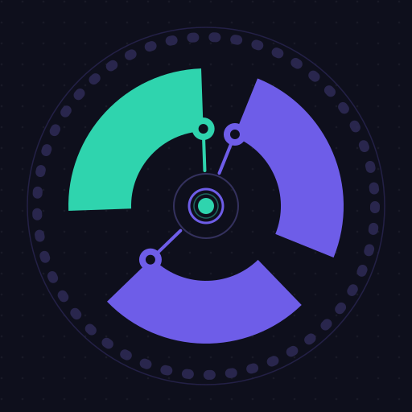
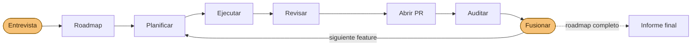

<p align="center">
  
</p>

# Agentic Workflow Skills

> 🇬🇧 [English version](README.md)

Un conjunto reutilizable de **skills para agentes** que ejecutan un flujo de
trabajo disciplinado y dirigido por documentación para construir software con
agentes — desde una idea o issue hasta un cambio revisado, clasificado y listo
para fusionar. Las skills son **adaptativas al proyecto**: descubren y obedecen
en tiempo de ejecución la guía, la arquitectura, el roadmap y las guías de estilo
de cada repositorio, así que el mismo flujo funciona en cualquier stack.

Son Markdown plano (ficheros `SKILL.md`), así que funcionan con **cualquier
agente** que lea skills — Claude Code, Cursor, Codex, OpenCode, Cline y
[más de 70](https://skills.sh) — instaladas con la CLI
[`skills`](https://github.com/vercel-labs/skills) (ver
[Instalación](#instalación)).

> Los ejemplos en `docs/` son genéricos e ilustrativos; las skills en sí
> son agnósticas del stack y de la arquitectura.

## Qué incluye

```
skills/                  las 16 skills (12 de cara al usuario + 4 internas) — la fuente instalable
.claude/skills           symlink → ../skills, para que este repo las use en Claude Code
template/                 el scaffold de documentación exportable (el sustrato que leen las skills)
docs/workflow/           el tutorial completo (flujo de feature, de issue, referencia, replicación)
docs/features/_TEMPLATE  plantilla de SPEC de feature + ROADMAP (los artefactos que generan las skills)
docs/fix/                plantilla de SPEC de fix + índice
.github/                 plantillas de issue + PR que el flujo espera
```

Las skills son el **comportamiento**; `template/` es el **sustrato** que leen (un
`CLAUDE.md` genérico + mapa de documentación, plantillas de SPEC/feature/fix y
plantillas de GitHub). Genera la forma de trabajo de un proyecto nuevo con
`npx degit gtrabanco/agentic-workflow/template mi-proyecto` — ver
[`docs/workflow/REPLICATE.md`](docs/workflow/REPLICATE.md).

## Las skills

**12 skills de cara al usuario** (una entrada de menú cada una) + **4 internas**,
pasos que se componen por ti (los tres pasos de planificación del router
`plan-feature` + el motor de `review-change`). Un único camino disciplinado:
**plan → execute → review → audit → merge.**

### Configuración inicial
| Skill | Qué hace |
|---|---|
| `init-workspace` | Trae el scaffold `template/` y lo **adapta a tu proyecto** por entrevista (gate, mapa de docs, arquitectura); sugiere las skills de revisión complementarias que necesita tu plataforma; ofrece instalar las skills |

### Planificación
| Skill | Qué hace |
|---|---|
| `plan-feature` | **Un único punto de entrada para planificar una feature.** Detecta la entrada — una idea en crudo (entrevista), un issue `#N` (issue → SPEC acotado) o un slug/SPEC ya acotado (directo al scaffolding) — enruta al paso correcto y registra la entrada en el roadmap. `--next` planifica el siguiente elemento del roadmap. **Dimensiona cada feature** (`XS/S/M/L`): las pequeñas van por la vía SPEC-only de una pasada — sin ceremonia de artefactos; las M/L llevan el set completo con fase de hardening obligatoria. |
| `plan-fix` | El equivalente del flujo de fix: como arquitecto redacta un SPEC de fix acotado a partir de un issue, commitea en una rama de fix y **se detiene para revisión**. |

> Solo llamas a `plan-feature`; este compone los pasos internos
> `plan-feature-interview`, `plan-feature-from-issue` y `plan-feature-scaffold`
> (ocultos del menú).

### Ejecución
| Skill | Qué hace |
|---|---|
| `execute-phase` | Implementa una fase de una feature (por defecto), una feature pequeña `XS/S` de una pasada, o un fix (`--fix`). **Tests primero** en trabajo de dominio/orquestación, nunca commitea en rojo, verificada por el gate, un commit por fase; **hace hand-off a `review-change` cada 2 fases y una vez al final (obligatorio)**. Una unidad terminada **siempre abre su PR y pasa a `done`** (construida, no mergeada). |

### Revisión y auditoría — *cambio → PR → producto*
| Skill | Alcance | Qué hace |
|---|---|---|
| `review-change` | el **cambio** | Ejecuta solo las revisiones que **aplican a tu plataforma** (código, seguridad, verify, diseño, a11y, marca, rendimiento, SEO) y clasifica → una tabla de decisión + una checklist explícita de verificación manual |
| `audit-pr` | el **PR** | Gate de fusión: criterios de aceptación cumplidos, todas las fases hechas, docs/tests/CI en verde, `Closes #N`, ejes de revisión limpios → **listo para fusionar o una lista de bloqueantes** |
| `product-audit` | el **producto** | Chequeo de salud periódico de espectro completo; mina las docs de features → propone issues + altas/bajas en el roadmap (**nunca arregla automáticamente**) |
| `audit-docs` | las **docs** | Audita docs ↔ roadmap ↔ código ↔ índice de fixes en busca de desviaciones |

> El motor de hallazgos de `review-change` es el `review-implementation` interno
> — la pasada de dos fases encontrar → clasificar que compone (y que reutilizan
> `audit-pr` / `product-audit`). No es una entrada de menú; llegas a él a través de
> `review-change`.

### Decisión
| Skill | Qué hace |
|---|---|
| `triage-issue` | Clasifica un issue (fix-now / promote / postpone / wontfix) **verificando su disparador contra el código** |

### Sesión
| Skill | Qué hace |
|---|---|
| `log-session` | Añade una entrada estructurada a `docs/LOGS.md` — qué hizo la sesión, archivos tocados, decisiones + *por qué*, y el siguiente paso — para que tú (o cualquiera) retome en frío. Ejecútala antes de `/clear` o de cerrar. El `template/` además trae **hooks gratuitos y opt-in** que añaden una entrada mecánica automáticamente en cada `/clear`/salida y pueden reinyectar la última entrada al arrancar. |

### Mantenimiento del repo
| Skill | Qué hace |
|---|---|
| `bump-skill` | Tras editar una skill en este repo: sube la `version:` en el frontmatter del SKILL.md, añade filas en CHANGELOG.md + CHANGELOG.es.md y actualiza las tablas de skills y modelos en README.md + README.es.md. Además **lintea las reglas de autoría del repo** (toda skill cierra con un bloque `→ Next:`; las fases son `P1, P2, …`, nunca `S1`/"Steps"). Ejecutar antes de cada commit que toque una skill. |

### Autopilot — el flujo completo, de punta a punta
| Skill | Qué hace |
|---|---|
| `ship-roadmap` | **Construye la app entera desde el roadmap.** Una entrevista inicial (producto, features, stack, arquitectura — recomendada *proporcionalmente*, nunca por defecto a un patrón con nombre —, calidad, ops, autonomía, presupuesto), funda el proyecto si hace falta, crea o adopta el roadmap completo, y un bucle con `/loop` lo entrega feature a feature a través de las skills de arriba — **sin más preguntas**. Por defecto: abre PRs y tú fusionas; `--fullauto` fusiona los PRs MERGE-READY bajo suelos de seguridad innegociables. Termina con un informe final: issues a abrir, propuestas de features descubiertas, checks manuales, cadencia de product-audit. |

Cómo el autopilot ejecuta el flujo — una entrevista al entrar, PRs revisadas al
salir, y tú solo apareces para fusionar (ámbar):



Es el mismo camino `planificar → ejecutar → revisar → auditar → fusionar` que
harías a mano — el autopilot solo te mueve a sus extremos. Con `--fullauto`,
`ship-roadmap` también se encarga de los merges, bajo suelos de seguridad
innegociables.

**Vídeo:** `ship-roadmap` creando una PR de principio a fin en un repositorio de
ejemplo.

[](https://www.youtube.com/watch?v=2Ai0NkTvoeM)

Las skills complementarias para UI/UX y calidad específica del lenguaje (diseño,
ux, tipado…) **no van incluidas** — `review-change` y `product-audit` las componen
cuando están instaladas, e `init-workspace` sugiere las adecuadas según la
plataforma. Ver `docs/workflow/RECOMMENDED_SKILLS.md` para saber cuáles aplican y
cuándo.

> **¿Actualizas desde una instalación anterior?** Mira
> [`docs/workflow/MIGRATION.md`](docs/workflow/MIGRATION.md) — se renombraron tres
> skills, así que vuelve a añadirlas para actualizar + borra las tres carpetas
> antiguas.
>
> **Versionado.** Cada skill se versiona de forma independiente (`version:` en su
> frontmatter); los cambios se registran en [`CHANGELOG.md`](CHANGELOG.md).
> Actualiza con `npx skills update`.

## Modelo y esfuerzo recomendados

Cada skill **fija su modelo y su esfuerzo** en el frontmatter (tabla abajo). El
modelo usa un alias de tier flotante (`opus`/`sonnet`/`haiku`) que se auto-actualiza
a la última versión — así no caduca. Ambos aplican solo durante el turno de esa
skill; tu modelo/esfuerzo de sesión vuelven después. **Tú mandas:** para cambiarlos,
edita las líneas `model:` / `effort:` de la skill (o `model: inherit` para seguir tu
sesión).

| Skill | Tier de modelo | Esfuerzo | Por qué |
|---|---|---|---|
| `init-workspace` | Opus | alto | bootstrap del proyecto guiado por entrevista + adaptación |
| `plan-feature` | Opus | alto | router + planificación: sus pasos internos de entrevista/scoping corren **en su turno**, así que el router debe llevar el effort (las skills compuestas heredan el effort del turno) |
| `plan-fix` | Opus | alto | scoping de arquitecto + análisis de riesgo |
| `execute-phase` | Sonnet | medio | implementación mecánica según el SPEC — una fase o de una pasada (Opus si la lógica es sutil) |
| `review-change` | Opus | alto | orquestación de revisión adaptativa a la plataforma + síntesis |
| `audit-pr` | Opus | alto | juicio de aptitud de fusión de todo el PR |
| `product-audit` | Opus | máx | barrido multi-eje de todo el producto + propuestas (effort máx para el barrido más amplio) |
| `audit-docs` | Sonnet | medio | comprobaciones cruzadas mayormente mecánicas (Opus para auditorías profundas) |
| `triage-issue` | Opus | alto | verificar disparadores contra el código; decisión con criterio |
| `log-session` | Sonnet | medio | resumen estructurado, no criterio — deliberadamente el tier barato, nunca Opus (los hooks de `.claude/` hacen la captura mecánica gratis) |
| `ship-roadmap` | Opus | alto | el conductor del autopilot: compone en su turno las skills de planificación/revisión/auditoría (mismo tier) y delega la implementación a subagentes Sonnet — el juicio se mantiene fuerte, los tokens masivos salen baratos |

> Los 4 pasos internos no se seleccionan directamente. Como se componen **dentro del
> turno del caller**, heredan su modelo/effort (el `model`/`effort` de una skill se
> fija al inicio del turno) — los valores de su frontmatter (`review-implementation`,
> `plan-feature-interview`, `plan-feature-from-issue` alto; `plan-feature-scaffold`
> medio) son defaults para una ejecución directa, y por eso el router `plan-feature`
> lleva `high`.
>
> Regla general: **planificar, decidir, revisar y auditar → Opus** (alto, o máx para
> el barrido de todo el producto); **ejecución mecánica → Sonnet, medio** (sube a Opus
> si la lógica es sutil).

## Cómo usarlas

Tutorial completo en **[`docs/workflow/`](docs/workflow/README.md)**. En resumen:

### Construir una feature
```
/plan-feature "<tu idea>"     # o  /plan-feature <N> (issue)  ·  /plan-feature --next (siguiente elemento del roadmap)
        → el router detecta idea / issue / slug acotado → entrevista · análisis del issue · scaffold
        → rellena el SPEC + PLAN + TASKS + … y registra la entrada en el roadmap
/execute-phase <NN> <phase>     # una fase cada vez, verificada por el gate, un commit cada una
        → checkpoint de revisión cada 2 fases (y obligatorio al final)
        → una unidad terminada siempre abre su PR + pasa a `done` (construida, no mergeada)
/review-change                  # obligatorio: revisiones aplicables, clasificadas; no-fix-now → triage-issue
/audit-pr                       # gate de fusión: listo o bloqueantes (nunca fusionar con docs pendientes)
        → el humano fusiona
```
Ver **[`docs/workflow/FEATURE_WORKFLOW.md`](docs/workflow/FEATURE_WORKFLOW.md)**.

### Gestionar un issue
```
/triage-issue <N>
   → lee el disparador "cuándo arreglar" del issue, lo verifica contra el código actual
   → fix-now  → plan-fix → execute-phase --fix
     promote  → plan-feature   (el router toma el issue → SPEC acotado)
     postpone → comentario con fecha, dejar abierto (sin trabajo inline)
     wontfix  → proponer cierre
```
Ver **[`docs/workflow/ISSUE_WORKFLOW.md`](docs/workflow/ISSUE_WORKFLOW.md)**.

### Revisar, auditar y clasificar
```
/review-change                  # ejecuta las revisiones correctas por plataforma + clasifica → una tabla + comprobaciones manuales
/audit-pr                       # ¿está ESTE PR listo para fusionar?  listo para fusionar o bloqueantes
/product-audit                  # ¿en qué punto está todo el producto?  issues + propuestas de roadmap
/audit-docs                     # ¿se han desviado las docs del código / roadmap?
```
Ver **[`docs/workflow/REVIEW_AND_CLASSIFY.md`](docs/workflow/REVIEW_AND_CLASSIFY.md)**.

### Construir la app entera (autopilot)
```
/ship-roadmap                   # UNA entrevista (producto, features, stack, arquitectura, autonomía, presupuesto)
        → funda el proyecto si hace falta, escribe el roadmap completo, fija la política del run
/loop /ship-roadmap --continue  # el bucle entrega el roadmap feature a feature (añade --fullauto para auto-fusionar)
        → plan → execute → review → PR → audit → (tu merge) → siguiente feature → … → informe final
```
Solo reapareces en los merges (por defecto) y en el informe final.

### Retomar entre sesiones
```
/log-session                    # antes de /clear o de cerrar: añade a docs/LOGS.md lo que hiciste + el siguiente paso
```
El `template/` trae hooks de Claude Code gratuitos y opt-in (`template/.claude/`)
que añaden una entrada mecánica automáticamente en cada `/clear` y salida, y
pueden reinyectar la última entrada al arrancar para retomar en frío — sin
modelo, sin coste de tokens en la captura.

## Principios fundamentales

1. **Las docs dirigen el trabajo** — cada skill lee primero la guía del proyecto,
   el mapa de docs, la arquitectura, el roadmap y las guías de estilo, y los respeta.
2. **Planificar antes de programar** — las features obtienen un SPEC + artefactos
   antes de escribir una sola línea.
3. **Una fase cada vez** — cada una verificada y commiteada por separado.
4. **Un PR por unidad, contra la rama por defecto** — nunca sobre `main`, nunca apilados.
5. **Evidencia sobre reflejo** — el triage verifica disparadores; el trabajo
   diferido se rastrea, no se mete inline.
6. **Gate antes del commit** — type-check + tests + build en verde.

## Instalación

Usa la CLI [`skills`](https://github.com/vercel-labs/skills) — lee los ficheros
`SKILL.md` directamente de este repo y los instala en el agente que uses
(autodetecta Claude Code, Cursor, Codex, OpenCode, Cline y
[más de 70](https://skills.sh)).

```sh
# Desde la raíz del repositorio DESTINO — instala las 14 skills:
npx skills add gtrabanco/agentic-workflow

# Elige skills concretas, o un agente concreto:
npx skills add gtrabanco/agentic-workflow --skill plan-feature --skill triage-issue
npx skills add gtrabanco/agentic-workflow --agent claude-code --agent cursor

# Instala para el usuario actual (global) en vez de para el proyecto actual:
npx skills add gtrabanco/agentic-workflow --global

# Gestiónalas después:
npx skills list
npx skills update
npx skills remove plan-feature

# Pinear una versión: instala desde un release etiquetado (o cualquier tag/rama) con #<ref>:
npx skills add gtrabanco/agentic-workflow#release-2026-06-19
#   …luego `npx skills experimental_install` restaura el conjunto exacto desde skills-lock.json.
#   Ver CHANGELOG.es.md → "Instalar y pinear una versión" para cómo funciona el pinning.
```

Sin publicar en npm, sin registro, sin paso de build — `skills` clona el repo y
copia (o enlaza con symlink) las carpetas de skills en el sitio correcto para
cada agente. Las skills **descubren el proyecto destino en tiempo de ejecución**
(guía del agente, mapa de documentación, arquitectura, roadmap, índice de fixes),
así que funcionan de inmediato sin configuración por repo.

¿Prefieres las skills **regeneradas y reajustadas** a las convenciones de otro
proyecto en lugar de copiadas literalmente? Mira el
**[prompt portable](docs/workflow/PORTABLE_PROMPT.md)** adaptativo. Todos los
detalles y la guía de "qué método cuándo" están en
**[`docs/workflow/REPLICATE.md`](docs/workflow/REPLICATE.md)**.

## Skills complementarias recomendadas

`docs/workflow/RECOMMENDED_SKILLS.md` lista las skills de calidad y arquitectura
**agnósticas del stack** que merece la pena tener (p. ej. `karpathy-guidelines`,
`code-review`, `security-review`, `simplify`, `skill-creator`, el conjunto
`engineering:*`) y —crucialmente— cuáles **omitir** según el proyecto (p. ej.
skills de diseño para un programa de terminal, `claude-api` si no hay features
con LLM).

## Proyectos construidos con este workflow

| Proyecto | Notas |
|---|---|
| [gtrabanco/ship-lab](https://github.com/gtrabanco/ship-lab) | CLI json2csv — construido de punta a punta con el autopilot `ship-roadmap` |
| [gtrabanco/bingo-ev](https://github.com/gtrabanco/bingo-ev) | Empezado con vibecoding, migrado al workflow cuando ya funcionaba |

