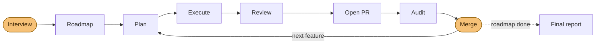

<p align="center">
  
</p>

# Agentic Workflow Skills

> 🇪🇸 [Versión en español](README.es.md)

A reusable set of **agent skills** that run a disciplined, doc-driven workflow
for building software with agents — from idea/issue to a reviewed, classified,
merge-ready change. The skills are **project-adaptive**: they discover and obey
each repository's own guide, architecture, roadmap and style docs at runtime, so
the same workflow works on any stack.

They are plain Markdown (`SKILL.md` files), so they work with **any agent** that
reads skills — Claude Code, Cursor, Codex, OpenCode, Cline, and
[70+ others](https://skills.sh) — installed with the
[`skills`](https://github.com/vercel-labs/skills) CLI (see
[Install](#install)).

> The examples in `docs/` are generic and illustrative; the skills
> themselves are stack-agnostic and architecture-agnostic.

## What's inside

```
skills/                  the 14 skills (10 user-facing + 4 internal) — the installable source
.claude/skills           symlink → ../skills, so this repo dogfoods them in Claude Code
template/                 the exportable documentation scaffold (the substrate the skills read)
docs/workflow/           the full tutorial (feature flow, issue flow, reference, replication)
docs/features/_TEMPLATE  feature SPEC template + ROADMAP (the planning artifacts skills produce)
docs/fix/                fix SPEC template + index
.github/                 issue + PR templates the workflow expects
```

The skills are the **behavior**; `template/` is the **substrate** they read (a
generic `CLAUDE.md` + documentation map, SPEC/feature/fix templates, and GitHub
templates). Scaffold a new project's way of working with
`npx degit gtrabanco/agentic-workflow/template my-project` — see
[`docs/workflow/REPLICATE.md`](docs/workflow/REPLICATE.md).

## The skills

**10 user-facing skills** (one menu entry each) + **4 internal** steps composed for
you (the `plan-feature` router's three planning steps + the `review-change`
engine). One disciplined path: **plan → execute → review → audit → merge.**

### Setup
| Skill | What it does |
|---|---|
| `init-workspace` | Fetches the `template/` scaffold and **adapts it to your project** by interview (gate, doc map, architecture); suggests the companion review skills your platform needs; offers to install the skills |

### Plan
| Skill | What it does |
|---|---|
| `plan-feature` | **One entry point to plan a feature.** Detects the input — a raw idea (interview), an issue `#N` (issue → scoped SPEC), or a scoped slug/SPEC (straight to scaffolding) — routes to the right step, then registers the roadmap entry. `--next` plans the next roadmap item. **Sizes every feature** (`XS/S/M/L`): small ones get a SPEC-only, single-pass path — no artifact ceremony; M/L get the full set with a mandatory hardening phase. |
| `plan-fix` | The fix-flow counterpart: architect-drafts a tightly-scoped fix SPEC from an issue, commits on a fix branch, **stops for review**. |

> You only ever call `plan-feature`; it composes the internal steps
> `plan-feature-interview`, `plan-feature-from-issue`, and `plan-feature-scaffold`
> (hidden from the menu).

### Execute
| Skill | What it does |
|---|---|
| `execute-phase` | Implements one phase of a feature (default), a small `XS/S` feature in a single pass, or a fix (`--fix`). **Tests-first** on domain/orchestration work, never commits red, gate-verified, one commit per phase; **hands off to `review-change` every 2 phases** (a review checkpoint, so it runs at its own model/effort). |

### Review & audit — *change → PR → product*
| Skill | Scope | What it does |
|---|---|---|
| `review-change` | the **change** | Runs only the reviews that **apply to your platform** (code, security, verify, design, a11y, brand, perf, SEO) and classifies → one decision table + an explicit manual-verification checklist |
| `audit-pr` | the **PR** | Merge gate: acceptance met, all phases done, docs/tests/CI green, `Closes #N`, review axes clean → **merge-ready or a list of blockers** |
| `product-audit` | the **product** | Periodic full-spectrum health check; mines feature docs → proposes issues + roadmap add/remove (**never auto-fixes**) |
| `audit-docs` | the **docs** | Audits docs ↔ roadmap ↔ code ↔ fix index for drift |

> `review-change`'s findings engine is the internal `review-implementation` — the
> two-phase find → classify pass it composes (and `audit-pr` / `product-audit`
> reuse). It's not a menu entry; you reach it through `review-change`.

### Decide
| Skill | What it does |
|---|---|
| `triage-issue` | Classifies an issue (fix-now / promote / postpone / wontfix) by **verifying its trigger against the code** |

### Autopilot — the whole flow, end to end
| Skill | What it does |
|---|---|
| `ship-roadmap` | **Builds the whole app from the roadmap.** One upfront interview (product, features, stack, architecture — recommended *proportionally*, never defaulting to a named pattern — quality bars, ops, autonomy, budget), founds the project if needed, creates or adopts the complete roadmap, then a `/loop`-driven build loop ships it feature by feature through the skills above — **with no further questions**. Default: opens PRs, you merge; `--fullauto` merges MERGE-READY PRs under non-negotiable safety floors. Ends with a final report: issues to open, discovered feature proposals, manual checks, product-audit cadence. |

How the autopilot runs the workflow — one interview in, reviewed PRs out, and
you only step in to merge (amber):



The same `plan → execute → review → audit → merge` path you'd run by hand — the
autopilot just moves you to its edges. Under `--fullauto`, `ship-roadmap` also
handles the merges, under non-negotiable safety floors.

Companion skills for UI/UX and language-specific quality (design, ux, typing…) are
**not bundled** — `review-change` and `product-audit` compose them when installed,
and `init-workspace` suggests the right ones per platform. See
`docs/workflow/RECOMMENDED_SKILLS.md` for which apply when.

> **Upgrading from an older install?** See
> [`docs/workflow/MIGRATION.md`](docs/workflow/MIGRATION.md) — three skills were
> renamed, so re-add to update + delete the three old folders.
>
> **Versioning.** Each skill is versioned independently (`version:` in its
> frontmatter); changes are logged in [`CHANGELOG.md`](CHANGELOG.md). Upgrade an
> install with `npx skills update`.

## Recommended model & effort

Each skill **pre-sets its model and effort** in frontmatter (table below). The
model uses a floating tier alias (`opus`/`sonnet`/`haiku`) that auto-updates to the
latest version — so it never goes stale. Both apply only for that skill's turn;
your session model/effort resume afterward. **You stay in control:** to change
them, edit the skill's `model:` / `effort:` lines (or `model: inherit` to follow
your session).

| Skill | Model tier | Effort | Why |
|---|---|---|---|
| `init-workspace` | Opus | high | interview-driven project bootstrap + adaptation |
| `plan-feature` | Opus | high | router + planning: its internal interview/scoping steps run **in its turn**, so the router must carry the effort (composed skills inherit the turn's effort) |
| `plan-fix` | Opus | high | architect-level scoping + risk analysis |
| `execute-phase` | Sonnet | medium | mechanical implementation per SPEC — one phase or single-pass (Opus if the logic is subtle) |
| `review-change` | Opus | high | platform-adaptive review orchestration + synthesis |
| `audit-pr` | Opus | high | whole-PR merge-readiness judgement |
| `product-audit` | Opus | max | product-wide multi-axis sweep + proposals (max effort for the widest context sweep) |
| `audit-docs` | Sonnet | medium | mostly mechanical cross-document checks (Opus for deep audits) |
| `triage-issue` | Opus | high | verify triggers against the code; judgement call |
| `ship-roadmap` | Opus | high | the autopilot conductor: composes the planning/review/audit skills in-turn (equal tier) and delegates implementation to Sonnet subagents — judgment stays strong, bulk tokens stay cheap |

> The 4 internal steps aren't selected directly. Because they're composed **within
> a caller's turn**, they inherit that turn's model/effort (a skill's `model`/`effort`
> is fixed at turn start) — the values in their frontmatter
> (`review-implementation`, `plan-feature-interview`, `plan-feature-from-issue` high;
> `plan-feature-scaffold` medium) are declared defaults for a direct run, which is
> why the `plan-feature` router itself carries `high`.
>
> Rule of thumb: **planning, judgement, review and audit → Opus** (high, or max for
> the product-wide sweep); **mechanical execution → Sonnet, medium** (bump to Opus
> when the logic is subtle).

## How to use them

Full tutorial in **[`docs/workflow/`](docs/workflow/README.md)**. In short:

### Build a feature
```
/plan-feature "<your idea>"     # or  /plan-feature <N> (issue)  ·  /plan-feature --next (next roadmap item)
        → router detects idea / issue / scoped slug → interview · issue analysis · scaffold
        → fills the SPEC + PLAN + TASKS + … and registers the roadmap entry
/execute-phase <NN> <phase>     # one phase at a time, gate-verified, one commit each
        → review checkpoint every 2 phases: hands off to /review-change (runs at its own model/effort)
/review-change                  # the reviews that apply to this change, classified (no refactor)
/audit-pr                       # merge gate: merge-ready or blockers
gh pr create --base main        # "Closes #N" if it came from an issue
```
See **[`docs/workflow/FEATURE_WORKFLOW.md`](docs/workflow/FEATURE_WORKFLOW.md)**.

### Handle an issue
```
/triage-issue <N>
   → reads the issue's "when to fix" trigger, verifies it against the current code
   → fix-now  → plan-fix → execute-phase --fix
     promote  → plan-feature   (the router takes the issue → scoped SPEC)
     postpone → dated comment, leave open (no inline work)
     wontfix  → propose close
```
See **[`docs/workflow/ISSUE_WORKFLOW.md`](docs/workflow/ISSUE_WORKFLOW.md)**.

### Review, audit & classify
```
/review-change                  # runs the right reviews per platform + classifies → one table + manual checks
/audit-pr                       # is THIS PR ready to merge?  merge-ready or blockers
/product-audit                  # where does the whole product stand?  issues + roadmap proposals
/audit-docs                     # did the docs drift from code / roadmap?
```
See **[`docs/workflow/REVIEW_AND_CLASSIFY.md`](docs/workflow/REVIEW_AND_CLASSIFY.md)**.

### Build the whole app (autopilot)
```
/ship-roadmap                   # ONE interview (product, features, stack, architecture, autonomy, budget)
        → founds the project if needed, writes the complete roadmap, locks the run policy
/loop /ship-roadmap --continue  # the loop ships the roadmap feature by feature (add --fullauto to auto-merge)
        → plan → execute → review → PR → audit → (your merge) → next feature → … → final report
```
You only reappear at the merges (default) and at the final report.

## Core principles

1. **Docs drive the work** — every skill reads the project's guide, doc map,
   architecture, roadmap and style docs first, and respects them.
2. **Plan before code** — features get a SPEC + artifacts before a line is written.
3. **One phase at a time** — each verified and committed separately.
4. **One PR per unit, against the default branch** — never on `main`, never stacked.
5. **Evidence over reflex** — triage verifies triggers; deferred work is tracked, not inlined.
6. **Gate before commit** — type-check + tests + build green.

## Install

Use the [`skills`](https://github.com/vercel-labs/skills) CLI — it reads the
`SKILL.md` files straight from this repo and installs them into whatever agent
you use (it auto-detects Claude Code, Cursor, Codex, OpenCode, Cline, and
[70+ more](https://skills.sh)).

```sh
# From the root of the TARGET repository — install all 14 skills:
npx skills add gtrabanco/agentic-workflow

# Pick specific skills, or target a specific agent:
npx skills add gtrabanco/agentic-workflow --skill plan-feature --skill triage-issue
npx skills add gtrabanco/agentic-workflow --agent claude-code --agent cursor

# Install for the current user (global) instead of the current project:
npx skills add gtrabanco/agentic-workflow --global

# Manage them later:
npx skills list
npx skills update
npx skills remove plan-feature
```

No npm publish, no registry, no build step — `skills` clones the repo and copies
(or symlinks) the skill folders into the right place for each agent. The skills
**discover the target project at runtime** (agent guide, documentation map,
architecture, roadmap, fix index), so they work immediately without per-repo
configuration.

Prefer the skills **regenerated and re-tuned** to a different project's
conventions instead of copied verbatim? See the adaptive
**[portable prompt](docs/workflow/PORTABLE_PROMPT.md)**. Full details and the
"which method when" guide live in
**[`docs/workflow/REPLICATE.md`](docs/workflow/REPLICATE.md)**.

## Recommended companion skills

`docs/workflow/RECOMMENDED_SKILLS.md` lists the **stack-agnostic** quality &
architecture skills worth having (e.g. `karpathy-guidelines`, `code-review`,
`security-review`, `simplify`, `skill-creator`, the `engineering:*` set), and —
crucially — which ones to **skip** for a given project (e.g. design skills for a
terminal program, `claude-api` with no LLM features).

## Projects built with this workflow

| Project | Notes |
|---|---|
| [gtrabanco/ship-lab](https://github.com/gtrabanco/ship-lab) | json2csv CLI — built end-to-end with the `ship-roadmap` autopilot |
| [gtrabanco/bingo-ev](https://github.com/gtrabanco/bingo-ev) | Started with vibecoding, migrated to the workflow once it was working |

## License

MIT © [Gabriel Trabanco](https://github.com/gtrabanco) — see [LICENSE](LICENSE).
