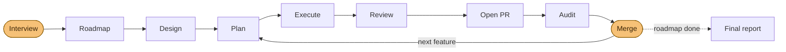

<p align="center">
  
</p>

<p align="center">
  <a href="https://www.youtube.com/watch?v=2Ai0NkTvoeM">
    
  </a>
  <br>
  <sub style="font-size: 0.75em;"><code>ship-roadmap</code> opening a PR end to end on a sample repository — click to watch</sub>
</p>

# Agentic Workflow Skills

> 🇪🇸 [Versión en español](README.es.md)

A reusable set of **agent skills** that run a disciplined, doc-driven workflow
for building software with agents — from idea/issue to a reviewed, classified,
merge-ready change. The skills are **project-adaptive**: they discover and obey
each repository's own guide, architecture, roadmap and style docs at runtime, so
the same workflow works on any stack.

They are plain Markdown (`SKILL.md` files), so they work with **any agent** that
reads skills — Claude Code, Cursor, Codex, OpenCode, Cline, and
[70+ others](https://skills.sh) — installed with the
[`skills`](https://github.com/vercel-labs/skills) CLI (see
[Install](#install)).

> The examples in `docs/` are generic and illustrative; the skills
> themselves are stack-agnostic and architecture-agnostic.

> ## ⚠️ Breaking change (v3, 2026-07-04): the default branch is now model-agnostic
>
> `npx skills add gtrabanco/agentic-workflow` (no `#ref`) now installs what used
> to be the **`#inheritance`** variant: no skill carries `model:`/`effort:`
> frontmatter, so every skill simply **inherits whatever model and effort your
> agent session is already using**. The goal: using this workflow should never
> lock you into one vendor's model lineup — you pick the model, the skills just
> run the discipline.
>
> - **On Claude Code and want the hand-tuned, per-skill Opus/Sonnet + effort
>   tiers this project used to ship by default?** Install the **`#claude`**
>   branch instead: `npx skills add gtrabanco/agentic-workflow#claude`.
> - **Already pinned `#inheritance`?** Nothing to do — `#inheritance` keeps
>   working, kept in sync as an exact alias of the default branch.
> - **Everyone else** (any other agent, or you'd rather choose tiers yourself):
>   the plain install command below already gives you this branch — no action
>   needed.
>
> See [`docs/workflow/MIGRATION.md`](docs/workflow/MIGRATION.md) for the full
> rationale and upgrade notes.

## What's inside

```
skills/                  the 28 skills (15 user-facing + 13 internal) — the installable source
.claude/skills           symlink → ../skills, so this repo dogfoods them in Claude Code
template/                 the exportable documentation scaffold (the substrate the skills read)
docs/workflow/           the full tutorial (feature flow, issue flow, reference, replication)
docs/features/_TEMPLATE  feature SPEC template + ROADMAP (the planning artifacts skills produce)
docs/fix/                fix SPEC template + index
.github/                 issue + PR templates the workflow expects
```

The skills are the **behavior**; `template/` is the **substrate** they read (a
generic `CLAUDE.md` + documentation map, SPEC/feature/fix templates, and GitHub
templates). Scaffold a new project's way of working with
`npx degit gtrabanco/agentic-workflow/template my-project` — see
[`docs/workflow/REPLICATE.md`](docs/workflow/REPLICATE.md).

## The skills

**15 user-facing skills** (one menu entry each) + **13 internal** ones composed
for you: the `plan-feature` router's two planning steps, the `review-change`
engine, the `orchestration-envelope` contract, and the workflow's **own 9-skill internal review pack** (`review-code`,
`review-security`, `review-verify`, `review-debt`, `review-design`,
`review-a11y`, `review-brand`, `review-perf`, `review-seo`) — so **no external
review skill is ever required**, on any agent, with any model. One disciplined
path: **design → plan → execute → review → audit → merge.**

> Every skill's invocation forms and flags (`--fix`, `--force`,
> `--adversarial N`, `--next`, `--fullauto`, …) are catalogued in the
> [Invocation & arguments reference](docs/workflow/SKILLS.md#invocation--arguments-reference).

### Setup

| Skill            | What it does                                                                                                                                                                                          |
| ---------------- | ----------------------------------------------------------------------------------------------------------------------------------------------------------------------------------------------------- |
| `init-workspace` | Fetches the `template/` scaffold and **adapts it to your project** by interview (gate, doc map, architecture); suggests the companion review skills your platform needs; offers to install the skills. On a repo that already has the scaffold, detects it and switches to **upgrade mode** — diffs against the current template and proposes only the blocks you're missing, never clobbering a tailored one |

### Design

| Skill            | What it does                                                                                                                                                                                                                                                                                                                                                                                                                                          |
| ---------------- | ------------------------------------------------------------------------------------------------------------------------------------------------------------------------------------------------------------------------------------------------------------------------------------------------------------------------------------------------------------------------------------------------------------------------------------------------------ |
| `design-feature` | **Product definition.** Folds in the raw-idea interview, then walks a fixed **capability-closure** checklist — for each entity: CRUD + state transitions, each with a UI entry point + API surface + test, or an explicit `n/a: <reason>`; for each capability: entry point + who may execute it; for each role: assigned/revoked/viewed where — into exhaustive acceptance criteria. Writes the SPEC's **product half**, stamps `## Design status: designed`, and sets the feature's roadmap row to `defined` (the `idea → defined` transition). Upserts on re-run; never destroys recorded decisions. |

### Plan

| Skill          | What it does                                                                                                                                                                                                                                                                                                                                                                                                                                  |
| -------------- | --------------------------------------------------------------------------------------------------------------------------------------------------------------------------------------------------------------------------------------------------------------------------------------------------------------------------------------------------------------------------------------------------------------------------------------------- |
| `plan-feature` | **Engineering-planning router for an already-designed feature.** The redirect gate keys on the **roadmap status** first (`idea`/absent → STOP → `design-feature`, no bypass flag; the SPEC `## Design status` marker is only the legacy-compat fallback for a pre-migration `planned` row). Given a designed feature, an issue `#N` (issue → scoped product half), or a scoped slug/SPEC (straight to engineering-half scaffolding), routes to the right step, then registers the roadmap entry. `--next` plans the next roadmap item. **Sizes every feature** (`XS/S/M/L`): small ones get a SPEC-only path with ≥ 2 phases in the SPEC (last = `Hardening & PR`) — no artifact ceremony; M/L get the full set with a mandatory hardening phase. |
| `plan-fix`     | The fix-flow counterpart: architect-drafts a tightly-scoped fix SPEC from an issue — always with a `## Phases` ledger (≥ 2 phases, last = `Hardening & PR`) — commits on a fix branch, **stops for review**.                                                                                                                                                                                                                                                                                                            |

> `design-feature` (product definition, folds in the raw-idea interview) must
> mark a feature `designed` before `plan-feature` will plan it — `plan-feature`
> refuses and redirects otherwise, no bypass flag. Once designed, you only ever
> call `plan-feature`; it composes the internal steps `plan-feature-from-issue`
> and `plan-feature-scaffold` (hidden from the menu).

### Execute

| Skill           | What it does                                                                                                                                                                                                                                                                                                                                                                      |
| --------------- | --------------------------------------------------------------------------------------------------------------------------------------------------------------------------------------------------------------------------------------------------------------------------------------------------------------------------------------------------------------------------------- |
| `execute-phase` | Implements one phase per invocation — of a feature (default), of a small `XS/S` feature, or of a fix (`--fix`); XS/S and fix phases live in the SPEC's `## Phases` (≥ 2 phases, the final one always `Hardening & PR` — the close-out chain in its own turn), and a legacy SPEC without `## Phases` runs end-to-end in a single pass. **Dependency gate first**: the unit's transitive `Depends on:` closure must be merged, or it stops with the unmet chain and build order (`--force` overrides, logged); an **own-status precondition** then redirects a sub-`planned` unit (`idea` → `/design-feature`, `defined` → `/plan-feature`). **Tests-first** on domain/orchestration work, never commits red, gate-verified, one commit per phase; **recommends a `review-change` checkpoint every 2 phases (skippable) and hands off once at the end (mandatory)**. **One phase = one session** on non-frontier models (never two phases per conversation — the `/loop` batch shape already re-invokes per phase). A finished unit **always opens its PR, prints the PR URL in the chat, and flips to `done`** (built, not merged); no turn ends with a dirty tree, and once the PR exists every commit is pushed immediately. |

### Review & audit — _change → PR → product_

| Skill           | Scope           | What it does                                                                                                                                                                                   |
| --------------- | --------------- | ---------------------------------------------------------------------------------------------------------------------------------------------------------------------------------------------- |
| `review-change` | the **change**  | Runs only the reviews that **apply to your platform** (code, security, verify, design, a11y, brand, perf, SEO) — adversarially by default, assuming the diff is wrong until proven otherwise — and classifies → one decision table + an explicit manual-verification checklist; a dirty tree or unpushed commits on the PR branch are fix-now `workflow` findings. The mandatory end review **must run in a conversation that did not implement the change** — if it did, stop and hand off to a fresh one. Opt-in `--adversarial N`: N independent context-clean reviewers run in parallel (subagents / headless / sequential-fallback), findings merged by `file:line` at an inclusion threshold of ≥1 — default off, auto-recommended (never forced) for `L`/sensitive changes |
| `audit-pr`      | the **PR**      | Merge gate: acceptance met, all phases done, docs/tests/CI green, `Closes #N`, review axes clean → **merge-ready or a list of blockers**, always with the PR's full URL; on MERGE-READY it posts a dated, SHA-bound comment on the PR itself. Opt-in auto-merge: with a documented policy it merges MERGE-READY PRs after a fail-closed cleanliness checklist (anything pending → push, wait for CI, re-audit) |
| `product-audit` | the **product** | Periodic full-spectrum health check; mines feature docs → proposes issues + roadmap add/remove + installed-tooling to register/re-design (**never auto-fixes**)                                                                          |
| `audit-docs`    | the **docs**    | Audits docs ↔ roadmap ↔ code ↔ fix index for drift                                                                                                                                             |

> `review-change`'s findings engine is the internal `review-implementation` — the
> two-phase find → classify pass it composes (and `audit-pr` / `product-audit`
> reuse) — plus the internal review pack: one `review-*` skill per axis, each a
> fixed checklist returning a findings table + PASS|FAIL. None are menu entries;
> you reach them through `review-change`.

### Decide

| Skill          | What it does                                                                                               |
| -------------- | ---------------------------------------------------------------------------------------------------------- |
| `triage-issue` | Classifies an issue (fix-now / promote / postpone / wontfix) by **verifying its trigger against the code** |

### Document

| Skill           | What it does                                                                                                                                                                                                                                                                                                                                                                                                                                                                       |
| --------------- | ----------------------------------------------------------------------------------------------------------------------------------------------------------------------------------------------------------------------------------------------------------------------------------------------------------------------------------------------------------------------------------------------------------------------------------------------------------------------------------- |
| `generate-docs` | Turns a unit's diff into **developer documentation on the project's own docs site** — incremental how-to guides through a discovered adapter (Starlight MDX first-class, plain markdown fallback), a **knowledge/call map** rendered from a project-declared deterministic command (the model never infers graph edges), and opt-in `--review` export of review reports. Provenance frontmatter lets `audit-docs` catch orphan/stale pages; never scaffolds a site, never edits code. |

### Session

| Skill         | What it does                                                                                                                                                                                                                                                                                                                                               |
| ------------- | ---------------------------------------------------------------------------------------------------------------------------------------------------------------------------------------------------------------------------------------------------------------------------------------------------------------------------------------------------------- |
| `log-session` | Appends a structured entry to `docs/LOGS.md` — what the session did, files touched, decisions + _why_, and the next step — so you (or anyone) can resume cold. Run it before `/clear` or before closing. The `template/` also ships **free, opt-in hooks** that auto-append a mechanical entry on `/clear`/exit and can re-inject the last entry on start. |
| `workflow-status` | **Read-only sensor for programmatic orchestration.** Computes the full project state — every feature/fix with its transitive dependency closure (met/unmet), the roadmap's five-state machine (`idea`/`defined`/`planned`/`in-progress`/`done`), what is startable right now (status ≥ `defined`, deps met) and in which build order, `idea` rows reported separately as design candidates, open PRs + audit state, pending fixes and findings awaiting triage — and emits it as one fixed JSON machine envelope. The piece an external driver calls between steps (see [Programmatic orchestration](#programmatic-orchestration)). Never edits anything. |

### Repo maintenance

| Skill        | What it does                                                                                                                                                                                                                                                                                                                                                                        |
| ------------ | ----------------------------------------------------------------------------------------------------------------------------------------------------------------------------------------------------------------------------------------------------------------------------------------------------------------------------------------------------------------------------------- |
| `bump-skill` | After editing a skill in this repo: bumps `version:` in the SKILL.md frontmatter, adds rows to CHANGELOG.md + CHANGELOG.es.md, and updates the skill and model tables in README.md + README.es.md. Also **lints the repo's authoring rules** (every skill closes with a `→ Next:` block; phases are `P1, P2, …`, never `S1`/"Steps"). Run before every commit that touches a skill. |

### Autopilot — the whole flow, end to end

| Skill          | What it does                                                                                                                                                                                                                                                                                                                                                                                                                                                                                                                                                                                                                           |
| -------------- | -------------------------------------------------------------------------------------------------------------------------------------------------------------------------------------------------------------------------------------------------------------------------------------------------------------------------------------------------------------------------------------------------------------------------------------------------------------------------------------------------------------------------------------------------------------------------------------------------------------------------------------- |
| `ship-roadmap` | **Builds the whole app from the roadmap.** One upfront interview (product, features, stack, architecture — recommended _proportionally_, never defaulting to a named pattern — quality bars, ops, autonomy, budget) **is batch design**: founding writes feature rows at `idea` (the founding-scaffolded skeleton feature lands at `planned`), founds the project if needed, creates or adopts the complete roadmap, then a driver-fired build loop (`/loop` on Claude Code, an external orchestrator, or manual re-invocation — every iteration says why it ended) ships it feature by feature through the skills above — **with no further questions**; a mid-run `idea` unit gets a DESIGN stage that JIT-designs it strictly from the locked interview record (undesignable → parked, never re-asked). After the last feature it keeps going: an **issue sweep** inventories open issues plus the run's documented residue (known-issues, trade-offs, postponed findings), triages everything, and ships the fix-now issues through the same stages. Default: opens PRs, you merge; `--fullauto` merges MERGE-READY PRs under non-negotiable safety floors. Ends with a final report: issues to open, discovered feature proposals, manual checks, product-audit cadence. |

How the autopilot runs the workflow — one interview in, reviewed PRs out, and
you only step in to merge (amber):



The same `plan → execute → review → audit → merge` path you'd run by hand — the
autopilot just moves you to its edges. Under `--fullauto`, `ship-roadmap` also
handles the merges, under non-negotiable safety floors.

The review axes are **self-contained**: the bundled internal review pack covers
code, security, verify, debt, design, a11y, brand, perf and SEO on any agent.
Platform-specific extras (a framework skill, a stack linter) are optional —
`review-change` and `product-audit` run them **in addition** when installed,
never as a dependency. See `docs/workflow/RECOMMENDED_SKILLS.md`.

> **Upgrading from an older install?** See
> [`docs/workflow/MIGRATION.md`](docs/workflow/MIGRATION.md) — three skills were
> renamed, so re-add to update + delete the three old folders.
>
> **Versioning.** Each skill is versioned independently (`version:` in its
> frontmatter); changes are logged in [`CHANGELOG.md`](CHANGELOG.md). Upgrade an
> install with `npx skills update`.

## Recommended model & effort

**This section documents the `#claude` branch** —
`npx skills add gtrabanco/agentic-workflow#claude`. The **default branch**
(`main`, aliased as `#inheritance`) carries none of this: every skill simply
inherits whatever model and effort your agent session is already using, so
there's nothing to configure and nothing to go stale.

On the `#claude` branch, each skill **pre-sets its model and effort** in
frontmatter (table below), sourced from
[`docs/workflow/model-routing.yml`](docs/workflow/model-routing.yml). The
model uses a floating tier alias (`opus`/`sonnet`/`haiku`) that auto-updates to the
latest version — so it never goes stale. Both apply only for that skill's turn;
your session model/effort resume afterward. **You stay in control:** to change
them, edit `model-routing.yml` (the source CI reads to rebuild the `claude`
branch — never edit the `claude` branch's frontmatter directly, it's
force-pushed on every change to `main`).

**On agents other than Claude Code**, or on the default branch, these tiers
don't apply — and that's covered: every user-facing skill ships a
**Portability** section with explicit fallbacks (no slash menu → follow the
target `SKILL.md` in a fresh conversation; no model tiers → strongest model
for planning/review/audit, cheaper for execution; no `/loop`/subagents →
manual re-invocation guided by each skill's closing `→ Next:` block). The
workflow is the contract; per-skill tiers are a `#claude`-branch convenience.

| Skill            | Model tier | Effort | Why                                                                                                                                                                                      |
| ---------------- | ---------- | ------ | ---------------------------------------------------------------------------------------------------------------------------------------------------------------------------------------- |
| `init-workspace` | Opus       | high   | interview-driven project bootstrap + adaptation                                                                                                                                          |
| `design-feature` | Opus       | high   | product-definition judgement: raw-idea interview + capability closure, composed by callers only at ≥ this tier                                                                          |
| `plan-feature`   | Opus       | high   | router + engineering planning: its internal scoping steps run **in its turn**, so the router must carry the effort (composed skills inherit the turn's effort)                           |
| `plan-fix`       | Opus       | high   | architect-level scoping + risk analysis                                                                                                                                                  |
| `execute-phase`  | Sonnet     | medium | mechanical implementation per SPEC — one phase per invocation (Opus if the logic is subtle)                                                                                              |
| `review-change`  | Opus       | high   | platform-adaptive review orchestration + synthesis                                                                                                                                       |
| `audit-pr`       | Opus       | high   | whole-PR merge-readiness judgement                                                                                                                                                       |
| `product-audit`  | Opus       | max    | product-wide multi-axis sweep + proposals (max effort for the widest context sweep)                                                                                                      |
| `audit-docs`     | Sonnet     | medium | mostly mechanical cross-document checks (Opus for deep audits)                                                                                                                           |
| `triage-issue`   | Opus       | high   | verify triggers against the code; judgement call                                                                                                                                         |
| `log-session`    | Sonnet     | medium | structured summarization, not judgement — deliberately the cheap tier, never Opus (the `.claude/` hooks do the mechanical capture for free)                                              |
| `workflow-status`| Sonnet     | medium | mechanical state reading + dependency-closure computation — a sensor, never judgment                                                                                                     |
| `generate-docs`  | Sonnet     | medium | structured summarization of a diff into guide pages; the graph is tool-generated, never model-inferred (Opus never needed)                                                               |
| `ship-roadmap`   | Opus       | high   | the autopilot conductor: composes the planning/review/audit skills in-turn (equal tier) and delegates implementation to Sonnet subagents — judgment stays strong, bulk tokens stay cheap |

> The internal skills aren't selected directly. Because they're composed
> **within a caller's turn**, they inherit that turn's model/effort (a skill's
> `model`/`effort` is fixed at turn start) — the values in their frontmatter
> (`review-implementation`, `plan-feature-from-issue`, `review-code`,
> `review-security` high; `plan-feature-scaffold` and the rest of the review
> pack medium) are declared defaults for a direct run, which is why the
> `plan-feature` and `review-change` orchestrators themselves carry `high`.
>
> Rule of thumb: **planning, judgement, review and audit → Opus** (high, or max for
> the product-wide sweep); **mechanical execution → Sonnet, medium** (bump to Opus
> when the logic is subtle).

### Model equivalence (non-Claude / free-inference models)

The Claude tiers above (the `#claude` branch) set a reference bar, but nothing
in the workflow depends on them — the skills are model-agnostic by design
(that's the point of the default branch). If you're on the default branch,
this table is just a mental-model guide for which "kind" of model to point
each skill at yourself; if you installed `#claude` anyway and want to swap
its pinned tiers for a different vendor, edit `docs/workflow/model-routing.yml`
accordingly:

| Claude default | Capability class | Use it for |
|---|---|---|
| Opus + `high`/`max` | **Frontier reasoning** — the strongest model you have, reasoning/thinking mode on | planning, review, audit, triage, the merge gate |
| Sonnet + `medium` | **Mid workhorse** — a solid coding model at default settings | mechanical execution per SPEC, doc checks, session logs |
| Haiku | **Small & cheap** — any fast lightweight model | optional grep-shaped evidence gathering |

**Concrete picks** (open-weight, as of **July 2026** — this landscape moves
fast; sanity-check against a current leaderboard before pinning):

- **Frontier reasoning** (⇔ Opus + `high`/`max`): **DeepSeek V4** (tops
  LiveCodeBench/Codeforces among open models), **Kimi K2.6** (strongest for
  agentic/repo-level coding and tool use), **GLM-5.x / GLM-4.7 Thinking**,
  **Qwen3 235B-A22B** — run in reasoning/thinking mode. Closed non-Claude
  equivalents: the top GPT / Gemini reasoning tier.
- **Mid workhorse** (⇔ Sonnet + `medium`): **DeepSeek V3.2** (the value pick
  via API), **Qwen3-Coder / Qwen3 32B**, **GLM-5.1**, or any of the frontier
  picks with reasoning mode off.
- **Small & cheap** (⇔ Haiku): **Qwen3 4–14B**, **Mistral Small 3.1**,
  **Gemma 3 27B**, **Phi-4-mini** — local-friendly, fine for grep-shaped work.

####  Running on [NaN.builders](https://cloud.nan.builders/r/7GK06FX8)

[NaN Cloud](https://cloud.nan.builders/r/7GK06FX8) serves the open-weight
frontier ([full catalog](https://nan.builders/docs/models): GLM-5.2 ~753B MoE ·
Mimo V2.5 310B · DeepSeek V4 Flash 284B · Qwen3.6 35B · Gemma4 26B) with
per-request **Thinking** toggle and **effort** control (Minimal → Max), which
maps 1:1 onto this workflow's tiers. Our picks per skill:

| Skill | NaN model | Thinking | Effort |
|---|---|---|---|
| `init-workspace`, `plan-feature`, `plan-fix`, `review-change`, `audit-pr`, `triage-issue` | **GLM-5.2** | on | High |
| `product-audit` | **GLM-5.2** | on | **Max** |
| `ship-roadmap` (conductor) | **GLM-5.2** | on | High |
| `execute-phase` (+ ship-roadmap's execution runs), `audit-docs`, `bump-skill`, `workflow-status` | **Qwen3.6** | off | Medium |
| `log-session`, evidence gathering | **DeepSeek V4 Flash** | off | Low |

Alternates: subtle implementation logic → bump `execute-phase` to GLM-5.2/High;
**Mimo V2.5** (a different family) reviewing Qwen-written code adds reviewer
independence; **Gemma4** swaps into the small tier. Whisper, Kokoro, Rerank,
Qwen3 Embedding and Flux 2 Klein are audio/retrieval/image models — not used by
the workflow. Sign up via [this referral link](https://cloud.nan.builders/r/7GK06FX8).

**If GLM-5.2 is down — fallback ladder:**

| # | Fallback | Config | Good for | Never for |
|---|---|---|---|---|
| 1 | **Mimo V2.5** (310B, reasoning, 1M ctx) | Thinking on, High (Max for `product-audit`) | **every** GLM-5.2 slot, including `audit-pr` and `product-audit`; as a cross-family reviewer it even adds independence | — |
| 2 | **Qwen3.6** (35B) | Thinking on, High | `plan-feature`, `plan-fix`, `init-workspace`, `triage-issue`, `ship-roadmap` conductor — their output is re-checked downstream by review/audit | `audit-pr` · `product-audit` · reviewing code Qwen3.6 itself wrote (≥ holds, independence doesn't) |
| 3 | **DeepSeek V4 Flash** (284B·21B active) | Thinking on, High | last-resort planning/triage when 1–2 are down | any verdict that gates a merge |
| — | **Gemma4** (26B) | — | small mechanical tier only | judgment, ever |

**The two merge-gating verdicts only run on tier 1 quality:** `audit-pr` and
`product-audit` may fall back to **Mimo V2.5** (Max effort), but never further
down — a mid-model sweep returns a *plausible-looking but shallow* report,
worse than no report. Both GLM-5.2 **and** Mimo V2.5 down → defer: the human
gates the merge manually, the product audit waits. Everything already at the
Qwen3.6/Flash tiers is unaffected by a GLM-5.2 outage.

**Already on the default branch (or `#inheritance`)?** No pinning to remove —
that's the point. Every skill already **inherits your session's model and
effort**; the plain install command gives you this:

```sh
npx skills add gtrabanco/agentic-workflow
```

**Want the Claude-tuned tiers pinned per skill instead?** Install `#claude`
(see the breaking-change note near the top of this README):

```sh
npx skills add gtrabanco/agentic-workflow#claude
```

`effort:` maps to your model's reasoning/thinking budget (`high` → maximum
reasoning; `medium` → default; no such control → just honor the strong/cheap
split above). Two invariants survive any mapping: **never review a change with a
model weaker than the one that wrote it — and prefer a different model family
than the writer's** (same-family instances share training blind spots,
cross-family decorrelates errors), and **audit verdicts (the merge gate)
get the strongest model you have**. Expect weaker models to follow the workflow
correctly — the skills are written as checklists and fixed output formats — but
produce shallower judgment; the discipline holds, the ceiling moves.

## Programmatic orchestration

The skills read cleanly in interactive chat — no trailing JSON. A driver that
wants to orchestrate them (a shell loop, CI, your own program) injects the
canonical **system-prompt snippet** so each invocation ends with a **machine
envelope** — one fixed, fenced JSON block (state, unit, phase, PR, findings,
blockers, dependency build order, recommended next command + model-tier
hint) — and runs a **repair loop** when a turn omits it (re-ask with a
one-line prompt; one retry, then a driver-level failure). The driver then
parses the envelope and invokes the next skill on the model you choose per
step. This is the vendor-neutral replacement for Claude Code's `/loop` and
subagents: the same loop `ship-roadmap` runs in-agent, hosted outside any
agent. `workflow-status` is the one skill that still emits the envelope
inline — it's a read-only sensor reporting the full dependency tree and
what's startable, so emitting it is its whole job. Protocol, snippet, repair
loop, state machine, and a driver skeleton:
**[`docs/workflow/ORCHESTRATION.md`](docs/workflow/ORCHESTRATION.md)**. For
JS/TS drivers, **[`@gtrabanco/agentic-workflow-schema`](packages/agentic-workflow-schema/)**
(npm) ships the types, the JSON Schema, and `parseEnvelope()` implementing the
parse contract — auto-published by CI on every schema change.

## How to use them

Full tutorial in **[`docs/workflow/`](docs/workflow/README.md)**. In short:

### Build a feature

```
/plan-feature "<your idea>"     # or  /plan-feature <N> (issue)  ·  /plan-feature --next (next roadmap item)
        → router detects idea / issue / scoped slug → interview · issue analysis · scaffold
        → fills the SPEC + PLAN + TASKS + … and registers the roadmap entry
/execute-phase <NN> <phase>     # one phase at a time, gate-verified, one commit each
        → review checkpoint recommended every 2 phases (mandatory at the end)
        → a finished unit always opens its PR + flips to `done` (built, not merged)
/review-change                  # mandatory: applicable reviews, classified; non-fix-now → triage-issue
/audit-pr                       # merge gate: merge-ready or blockers (never merge with pending docs)
        → human merges
```

See **[`docs/workflow/FEATURE_WORKFLOW.md`](docs/workflow/FEATURE_WORKFLOW.md)**.

### Handle an issue

```
/triage-issue <N>
   → reads the issue's "when to fix" trigger, verifies it against the current code
   → fix-now  → plan-fix → execute-phase --fix
     promote  → plan-feature   (the router takes the issue → scoped SPEC)
     postpone → dated comment, leave open (no inline work)
     wontfix  → propose close
```

See **[`docs/workflow/ISSUE_WORKFLOW.md`](docs/workflow/ISSUE_WORKFLOW.md)**.

### Review, audit & classify

```
/review-change                  # runs the right reviews per platform + classifies → one table + manual checks
/audit-pr                       # is THIS PR ready to merge?  merge-ready or blockers
/product-audit                  # where does the whole product stand?  issues + roadmap proposals
/audit-docs                     # did the docs drift from code / roadmap?
```

See **[`docs/workflow/REVIEW_AND_CLASSIFY.md`](docs/workflow/REVIEW_AND_CLASSIFY.md)**.

### Build the whole app (autopilot)

```
/ship-roadmap                   # ONE interview (product, features, stack, architecture, autonomy, budget)
        → founds the project if needed, writes the complete roadmap, locks the run policy
/loop /ship-roadmap --continue  # the loop ships the roadmap feature by feature (add --fullauto to auto-merge)
        → plan → execute → review → PR → audit → (your merge) → next feature → … → final report
```

You only reappear at the merges (default) and at the final report.

### Resume across sessions

```
/log-session                    # before /clear or closing: append what you did + the next step to docs/LOGS.md
```

The `template/` ships free, opt-in Claude Code hooks (`template/.claude/`) that
auto-append a mechanical entry on every `/clear` and exit, and can re-inject the
last entry on start so you resume cold — no model, no token cost for the capture.

## Core principles

1. **Docs drive the work** — every skill reads the project's guide, doc map,
   architecture, roadmap and style docs first, and respects them.
2. **Plan before code** — features get a SPEC + artifacts before a line is written.
3. **One phase at a time** — each verified and committed separately.
4. **One PR per unit, against the default branch** — never on `main`, never stacked.
5. **Evidence over reflex** — triage verifies triggers; deferred work is tracked, not inlined.
6. **Gate before commit** — type-check + tests + build green.

## Install

Use the [`skills`](https://github.com/vercel-labs/skills) CLI — it reads the
`SKILL.md` files straight from this repo and installs them into whatever agent
you use (it auto-detects Claude Code, Cursor, Codex, OpenCode, Cline, and
[70+ more](https://skills.sh)).

```sh
# From the root of the TARGET repository — install all the skills.
# Default branch: model-agnostic, every skill inherits YOUR session's model
# and effort. On Claude Code and want the hand-tuned per-skill tiers this
# project shipped by default before v3? Add #claude — see the breaking-change
# note above.
npx skills add gtrabanco/agentic-workflow
npx skills add gtrabanco/agentic-workflow#claude          # Claude-optimized tiers

# Pick specific skills, or target a specific agent:
npx skills add gtrabanco/agentic-workflow --skill plan-feature --skill triage-issue
npx skills add gtrabanco/agentic-workflow --agent claude-code --agent cursor

# Install for the current user (global) instead of the current project:
npx skills add gtrabanco/agentic-workflow --global

# Manage them later:
npx skills list
npx skills update
npx skills remove plan-feature

# Already pinned #inheritance before v3? It still works — kept as an exact
# alias of the (now model-agnostic) default branch:
npx skills add gtrabanco/agentic-workflow#inheritance

# Pin a version: install from a tagged release (or any tag/branch) with #<ref>:
npx skills add gtrabanco/agentic-workflow#release-2026-07-02
#   …then `npx skills experimental_install` restores the exact set from skills-lock.json.
#   See CHANGELOG.md → "Installing & pinning a version" for how pinning works.
```

### Updating an existing install

`npx skills add …` / `npx skills update` only refreshes the **skills**
(behavior) — on a project that already has the documentation scaffold, run
this ordered path to bring the **substrate** (`CLAUDE.md` + `docs/`) forward
too:

1. Update the skills: `npx skills update` (or a fresh `npx skills add …`).
2. Read **[`docs/workflow/MIGRATION.md`](docs/workflow/MIGRATION.md)** — the
   dated rationale for what changed and why.
3. Run **`init-workspace`** — on a repo it recognizes as an existing
   agentic-workflow scaffold it enters **upgrade mode**: it diffs your
   substrate against the current `template/`, proposes only the blocks you're
   missing (discovery-defaulted, one short interview), and never rewrites a
   block you've already tailored.
4. Optionally run **`product-audit`** to see which newly-available
   *capabilities* (not just docs blocks) now apply to your code.

### Installing on Hermes Agent (desktop & terminal)

Hermes only scans **`~/.hermes/skills/`** (its "source of truth") plus any
`external_dirs` you add in `~/.hermes/config.yaml` — it does **not** scan the
project-scope paths the `skills` CLI writes by default (`./.hermes/skills/`,
`./.agents/skills/`). That's why a plain project install "isn't detected".
Desktop app and terminal share the same mechanism. Category subfolders
(`skills/devops/<skill>/`) are optional — flat `<skill>/SKILL.md` folders are
detected fine.

```sh
# Install (Hermes ignores model:/effort: anyway, so the default branch's
# model-agnostic skills — inheriting whatever model your Hermes session
# runs — are the right pick here, not #claude):
npx skills add gtrabanco/agentic-workflow --agent hermes-agent --global -y
#   → copies each skill to ~/.hermes/skills/<skill>/  ✔ detected by desktop & terminal

# Update later — re-run the add per agent, NOT `skills update`:
npx skills add gtrabanco/agentic-workflow --agent hermes-agent --global -y
npx skills add gtrabanco/agentic-workflow#claude --agent claude-code --global -y   # if you also install globally for Claude Code
#   Why: the global lockfile tracks ONE ref per skill name (last install wins),
#   so a blanket `skills update --global` can repoint every agent's copy to the
#   same ref — re-running each add refreshes each copy from its own ref.
#   Then start a NEW Hermes session (/reset in terminal, or restart the desktop
#   app) — skills load at session start; --now busts the prompt cache (extra tokens).
```

Per-project alternative: keep a project-local install and point Hermes at it in
`~/.hermes/config.yaml`:

```yaml
skills:
  external_dirs:
    - /path/to/your-project/.agents/skills
```

(Local `~/.hermes/skills/` wins on name collisions; missing dirs are silently
skipped.) Pick your session model per the [model-equivalence table](#model-equivalence-non-claude--free-inference-models)
— on NaN.builders, per the picks above.

**Invoking:** in Hermes, `/<name>` loads **bundles**, not individual skills —
`/execute-phase` returns `error: not a quick/plugin/skill command` even when
the skill shows as enabled. Three working ways:

```sh
# 1. One-time: create a bundle → /workflow becomes the slash entry point
hermes bundles create workflow \
  -s init-workspace -s plan-feature -s plan-fix -s execute-phase \
  -s review-change -s audit-pr -s product-audit -s audit-docs \
  -s triage-issue -s log-session -s ship-roadmap \
  -d "agentic-workflow: plan → execute → review → audit → merge"
#    then, in any session:  /workflow execute-phase --fix #243

# 2. Terminal: preload skills for a session
hermes chat -s execute-phase

# 3. Any session, no setup: natural language — skills are matched by description
#    "use the execute-phase skill to implement fix #243"
```

No npm publish, no registry, no build step — `skills` clones the repo and copies
(or symlinks) the skill folders into the right place for each agent. The skills
**discover the target project at runtime** (agent guide, documentation map,
architecture, roadmap, fix index), so they work immediately without per-repo
configuration.

Prefer the skills **regenerated and re-tuned** to a different project's
conventions instead of copied verbatim? See the adaptive
**[portable prompt](docs/workflow/PORTABLE_PROMPT.md)**. Full details and the
"which method when" guide live in
**[`docs/workflow/REPLICATE.md`](docs/workflow/REPLICATE.md)**.

## Optional extra skills

The workflow needs **nothing beyond this repo** — the internal review pack covers
every review axis on any agent. `docs/workflow/RECOMMENDED_SKILLS.md` lists
**optional extras** that can sharpen specific axes when your agent has them
(e.g. `karpathy-guidelines`, `simplify`, the `engineering:*` set), and — crucially
— which ones to **skip** for a given project (e.g. design skills for a terminal
program, `claude-api` with no LLM features). Extras merge into the same review
tables; a missing extra is never a gap.

## Projects built with this workflow

| Project                                                     | Notes                                                                 |
| ----------------------------------------------------------- | --------------------------------------------------------------------- |
| [gtrabanco/ship-lab](https://github.com/gtrabanco/ship-lab) | json2csv CLI — built end-to-end with the `ship-roadmap` autopilot     |
| [gtrabanco/bingo-ev](https://github.com/gtrabanco/bingo-ev) | Started with vibecoding, migrated to the workflow once it was working |
