# Roadmap Execution Order

**Generated:** 2026-09-09  
**Rule:** #176 is always last (skill-context budget slimming after all features settle)  
**Priority:** Speed/token efficiency > foundation > dependencies > quality gates

## Triage Applied

| Issue | Labels Added | Reason |
|-------|-------------|--------|
| #177 | `enhancement` | Planning improvement |
| #174 | `enhancement` | Pi package feature |
| #209 | `bug` | Release policy guard |
| #207 | `enhancement` | Design process improvement |
| #206 | `enhancement` | Design research gate improvement |

## Execution Order

### Phase 1: Foundation Scripts (Biggest Token Savings)

These replace prose with deterministic scripts → immediate, compounding savings.

| # | Issue | Maps to | Depends On |
|---|-------|---------|------------|
| 1 | **#184** — Deterministic phase-lint | feat 37 | — |
| 2 | **#185** — Deterministic workflow-status sensor | feat 38 | — |
| 3 | **#183** — Verification-contract hygiene | feat 36 | — |
| 4 | **#180** — Versioned skills releases (auto bump) | feat 40 | 184, 185 |

**Why first:** Scripts replace model runs on every execution. Each script saves tokens forever.

### Phase 2: Review Convergence (Fix Before Slimming)

Review loops manufacture findings. Fix the loop first.

| # | Issue | Maps to | Depends On |
|---|-------|---------|------------|
| 5 | **#205** — Review loops do not converge | (meta-issue) | 184, 185, 183 |
| 6 | **#206** — Design research gate too narrow | (new feat) | 205 |
| 7 | **#177** — Planning-review scope: verify ledger | feat 31 | 205 |
| 8 | **#171** — Planning-side review alignment | feat 31 | 177 |
| 9 | **#172** — Review-pack consistency | feat 32 | 171, 177 |

**Why here:** You can't slim what doesn't converge. Fix the loop → then the process is stable for slimming.

### Phase 3: Consistency & Verification

| # | Issue | Maps to | Depends On |
|---|-------|---------|------------|
| 10 | **#182** — Scope bindings to affecting paths | feat 35 | 172 |
| 11 | **#183** — Verification-contract-hygiene | feat 36 | 183 |
| 12 | **#182** — Scoped-receipt-verifier | feat 35 | 172, 182 |

### Phase 4: Process Polish

| # | Issue | Maps to | Depends On |
|---|-------|---------|------------|
| 13 | **#207** — Reuse-first design | (new feat) | 206 |
| 14 | **#152** — Bilingual sibling drift check | feat 34 | — |
| 15 | **#198** — Per-skill package layout | feat 44 | 184, 185 |

### Phase 5: Versioning & Release Policy

| # | Issue | Maps to | Depends On |
|---|-------|---------|------------|
| 16 | **#209** — Release policy: no major versions | (policy) | 172 |
| 17 | **#180** — Versioned skills releases | feat 40 | 172, 180 |

### Phase 6: Pi Package Features

| # | Issue | Maps to | Depends On |
|---|-------|---------|------------|
| 18 | **#186** — Pi auto log-session | feat 39 | — |
| 19 | **#174** — Pi state-flow lifecycle | feat 41 | 186 |
| 20 | **#186** — Pi-auto-log-session | feat 39 | 186 |
| 21 | **#174** — Pi-state-flow-lifecycle | feat 41 | 174 |

### Phase 7: New Features (Lower Priority)

| # | Issue | Maps to | Depends On |
|---|-------|---------|------------|
| 22 | **#192** — Doc toolchain (experimental) | (new feat) | — |
| 23 | **#194** — Deterministic review-change | feat 42 | 172, 182 |

### Phase 8: Final Slimming (ALWAYS LAST)

| # | Issue | Maps to | Depends On |
|---|-------|---------|------------|
| 24 | **#176** — Slim SKILL context routes | feat 33 | ALL PHASES |

## Dependency Graph (Mermaid)

```mermaid
graph TD
    subgraph P1["Phase 1: Foundation Scripts"]
        A[#184 phase-lint]
        B[#185 workflow-status sensor]
        C[#183 verification hygiene]
        D[#180 versioned releases]
    end

    subgraph P2["Phase 2: Review Convergence"]
        E[#205 review loops]
        F[#206 design research gate]
        G[#177 planning-review scope]
        H[#171 planning materiality]
        I[#172 review consistency]
    end

    subgraph P3["Phase 3: Consistency & Verification"]
        J[#182 scope bindings]
        K[#183 verification hygiene]
        L[#182 scoped receipt verifier]
    end

    subgraph P4["Phase 4: Process Polish"]
        M[#207 reuse-first design]
        N[#152 bilingual drift check]
        O[#198 per-skill package layout]
    end

    subgraph P5["Phase 5: Versioning"]
        P[#209 release policy]
        Q[#180 versioned releases]
    end

    subgraph P6["Phase 6: Pi Features"]
        R[#186 pi auto log]
        S[#174 pi state-flow]
        T[#186 pi auto log session]
        U[#174 pi state-flow lifecycle]
    end

    subgraph P7["Phase 7: New Features"]
        V[#192 doc toolchain]
        W[#194 deterministic review-change]
    end

    subgraph P8["Phase 8: Final"]
        X[#176 slim SKILL context]
    end

    P1 --> P2
    P2 --> P3
    P3 --> P4
    P4 --> P5
    P5 --> P6
    P6 --> P7
    P7 --> P8

    linkStyle 0,1,2,3,4,5,6 stroke-width:4px,fill:none,stroke:red
```

## Key Decisions

1. **#176 last** — User explicitly requested. Slimming context budgets only makes sense after all features that add content are done.
2. **Scripts before prose** — Foundation scripts (#184, #185, #183) first because they save tokens on every future run. Compounding savings.
3. **Convergence before slimming** — Review loops (#205) must be fixed before #176. Slimming a broken process wastes effort.
4. **#209 early** — Release policy freeze prevents accidental major bumps while experimental features ship.
5. **#192 last among features** — Experimental doc toolchain, low priority, no dependencies blocking anything.
6. **Pi features grouped** — #186 → #174 is a dependency chain; group together.